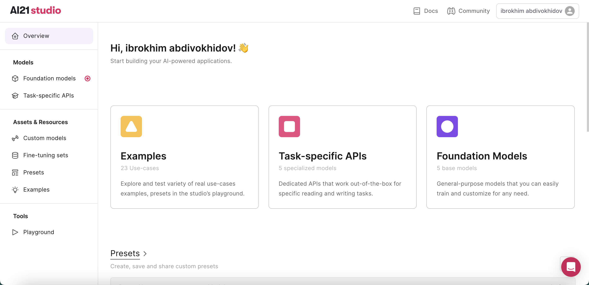
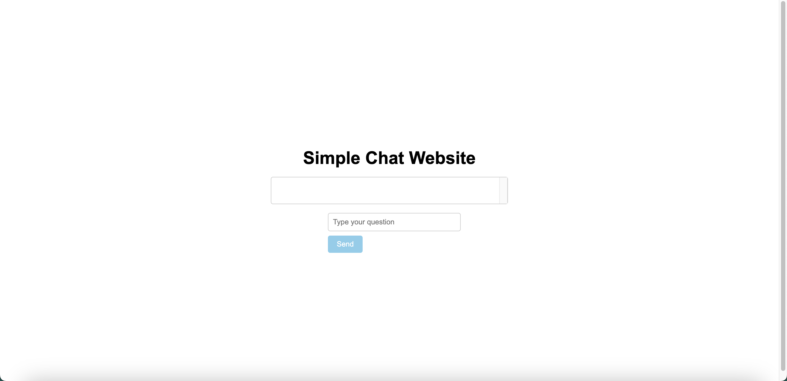
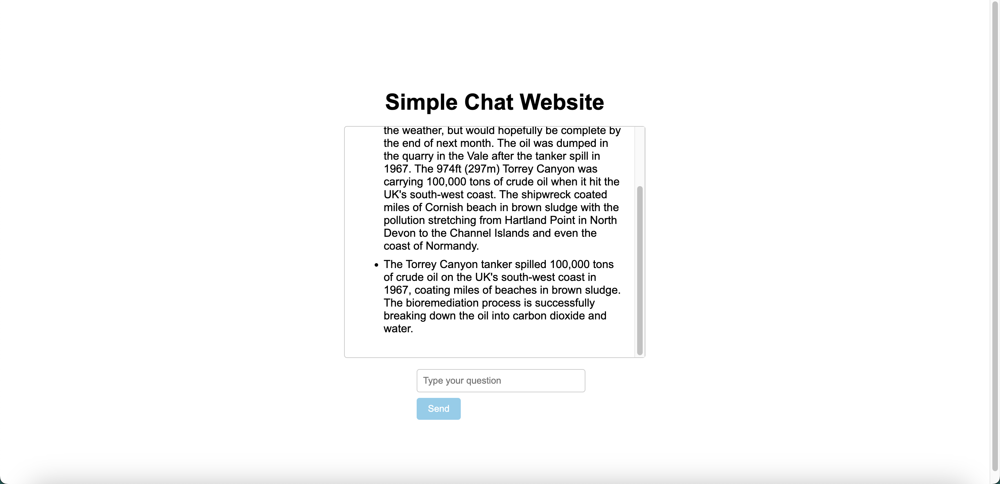

## Introduction
[AI21 Studio](https://www.ai21.com/studio) is a platform that provides developers and businesses with top-tier natural language processing (NLP) solutions, powered by AI21 Labs’ state-of-the-art language models. 


## What we are going to do?
In this tutorial, we will learn how to build AI app with no coding skills with AI21 Studio if you have complitely no coding background. Sit back, relax, enjoy the tutorial and don't forget to make a cup of coffee ☕️.


### Learning outcomes
- How to build AI app with no coding skills.
- How to properly query ChatGPT (Prompt engineering).
- Get familiar with AI21 Studio.


### We will cover the following steps:

1. Creating a AI21 Studio account and get API key.
2. Create a new project and build our first AI app.


### Prerequisites
Make sure you have access to [ChatGPT](https://chat.openai.com/).
Make sure you have installed Visual Studio Code (VSCode) on your machine. If you don't have it, you can download it [here](https://code.visualstudio.com/download). Or you can use any other code editor of your choice.
Nothing else is required. Let's get started!


## Getting started


### Step 1: Create a AI21 Studio account and get API key

First, we need to create a AI21 Studio account. If you already have one, you can skip this step and [go here](https://studio.ai21.com/task-specific-apis). If you don't have one, you can create a free account [here](https://www.ai21.com/studio).

If you successfully created an account, you should see a page like this:



Great! Now, we need to get our API key. On the top right corner, click on your `profile picture` > `API Key` and copy/save your API key.


### Step 2: Create a new project

Open Visual Studio Code (VSCode) and create a new folder: 

```bash
ai21-studio-tutorial
cd ai21-studio-tutorial
```

Now, go to [ChatGPT](https://chat.openai.com/) and prompt:

```bash
Build me simple website where user can ask question and get answer. It should has a input field and button, when user presses button it should sent request to the backend url and show the response and it should also track all the chat messages like saving in array.
```

You should get something like this:

HTML code:

```bash
<!DOCTYPE html>
<html>
<head>
  <title>Simple Chat Website</title>
</head>
<body>
  <h1>Simple Chat Website</h1>

  <div id="chat-container">
    <ul id="chat-messages"></ul>
  </div>

  <form id="chat-form">
    <input type="text" id="message-input" placeholder="Type your question" required>
    <button type="submit">Send</button>
  </form>

  <script src="script.js"></script>
</body>
</html>
```

And also

JavaScript code:

```bash
// Array to store chat messages
let chatMessages = [];

// Function to display chat messages
function displayChatMessages() {
  const chatMessagesElement = document.getElementById('chat-messages');
  chatMessagesElement.innerHTML = '';
  
  chatMessages.forEach(message => {
    const li = document.createElement('li');
    li.textContent = message;
    chatMessagesElement.appendChild(li);
  });
}

// Function to handle form submission
function handleSubmit(event) {
  event.preventDefault();

  const inputElement = document.getElementById('message-input');
  const message = inputElement.value;

  // Add message to chat array
  chatMessages.push(message);

  // Display chat messages
  displayChatMessages();

  // Send request to backend URL (you need to replace 'backend-url' with your actual backend URL)
  fetch('backend-url', {
    method: 'POST',
    headers: {
      'Content-Type': 'application/json'
    },
    body: JSON.stringify({
      message: message
    })
  })
  .then(response => response.json())
  .then(data => {
    // Handle the response from the backend
    // Assuming the backend returns an 'answer' property in the response JSON
    const answer = data.answer;

    // Add the answer to the chat array
    chatMessages.push(answer);

    // Display chat messages
    displayChatMessages();
  });

  // Clear input field
  inputElement.value = '';
}

// Attach event listener to form submit
const form = document.getElementById('chat-form');
form.addEventListener('submit', handleSubmit);
```


Now, create two files: `index.html` and `script.js`. Copy/paste ChatGPT generated `HTML` and `JavaScript` codes into `index.html` and `script.js` files respectively.

Make sure you have installed [Live Server](https://marketplace.visualstudio.com/items?itemName=ritwickdey.LiveServer) extension on your VSCode. If you don't have it, you can install it [here](https://marketplace.visualstudio.com/items?itemName=ritwickdey.LiveServer).

Click on `Go Live` button on the bottom right corner of your VSCode. You should see a page like this:


Nice! Not bad for a first try. 


Let's add some styling to our app. Go to [ChatGPT](https://chat.openai.com/) and prompt:

```bash
Great! Now add styling to html. Center everything, make send button sky blue, style input field and chat items as well.
```

You should get something like this:


HTML code:


```bash
<!DOCTYPE html>
<html>
<head>
  <title>Simple Chat Website</title>
  <style>
    body {
      display: flex;
      justify-content: center;
      align-items: center;
      height: 100vh;
      flex-direction: column;
      font-family: Arial, sans-serif;
    }

    h1 {
      margin-bottom: 1rem;
    }

    #chat-container {
      width: 400px;
      border: 1px solid #ccc;
      border-radius: 4px;
      padding: 1rem;
      margin-bottom: 1rem;
      max-height: 300px;
      overflow-y: scroll;
    }

    #message-input {
      width: 100%;
      padding: 0.5rem;
      border: 1px solid #ccc;
      border-radius: 4px;
      margin-bottom: 0.5rem;
    }

    #chat-form button {
      background-color: skyblue;
      color: #fff;
      padding: 0.5rem 1rem;
      border: none;
      border-radius: 4px;
      cursor: pointer;
    }

    #chat-form button:hover {
      background-color: #0080FF;
    }

    #chat-messages li {
      margin-bottom: 0.5rem;
      word-wrap: break-word;
    }
  </style>
</head>
<body>
  <h1>Simple Chat Website</h1>

  <div id="chat-container">
    <ul id="chat-messages"></ul>
  </div>

  <form id="chat-form">
    <input type="text" id="message-input" placeholder="Type your question" required>
    <button type="submit">Send</button>
  </form>

  <script src="script.js"></script>
</body>
</html>
```

Go to `index.html` file and replace the old `HTML` code with the new one. Then, go back to your browser and refresh the page. You should see something like this:




Cool! Looks much better now. You can play around with the styling to make it look even better. For now we will leave it as it is.


Go back to [AI21 Studio dashboard](https://studio.ai21.com/overview) and click on `Task-specific APIs`:


Click on `Summarize`


Go to back `script.js` file and update fetch part with real API endpoint. To do so, simply replace this part of the code with the new one:

```bash

  fetch('https://api.ai21.com/studio/v1/summarize', {
    method: 'POST',
    headers: {
      'Authorization': 'Bearer YOUR_API_KEY',
      'Accept': 'application/json',
      'Content-Type': 'application/json',
    },
    body: JSON.stringify({
        sourceType: 'TEXT',
        source: message
    })
  })
  .then(response => response.json())
  .then(data => {
    // Handle the response from the backend
    // Assuming the backend returns an 'answer' property in the response JSON
    const answer = data.summary;

    console.log(answer);

    // Add the answer to the chat array
    chatMessages.push(answer);

    // Display chat messages
    displayChatMessages();
  });

```

Full code of `script.js` file:

```bash
// Array to store chat messages
let chatMessages = [];

// Function to display chat messages
function displayChatMessages() {
  const chatMessagesElement = document.getElementById('chat-messages');
  chatMessagesElement.innerHTML = '';
  
  chatMessages.forEach(message => {
    const li = document.createElement('li');
    li.textContent = message;
    chatMessagesElement.appendChild(li);
  });
}

// Function to handle form submission
function handleSubmit(event) {
  event.preventDefault();

  const inputElement = document.getElementById('message-input');
  const message = inputElement.value;

  // Add message to chat array
  chatMessages.push(message);

  // Display chat messages
  displayChatMessages();

  // Send request to backend URL (you need to replace 'backend-url' with your actual backend URL)
  fetch('https://api.ai21.com/studio/v1/summarize', {
    method: 'POST',
    headers: {
      'Authorization': 'Bearer YOUR_API_KEY',
      'Accept': 'application/json',
      'Content-Type': 'application/json',
    },
    body: JSON.stringify({
        sourceType: 'TEXT',
        source: message
    })
  })
  .then(response => response.json())
  .then(data => {
    // Handle the response from the backend
    // Assuming the backend returns an 'answer' property in the response JSON
    const answer = data.summary;

    console.log(answer);

    // Add the answer to the chat array
    chatMessages.push(answer);

    // Display chat messages
    displayChatMessages();
  });

  // Clear input field
  inputElement.value = '';
}

// Attach event listener to form submit
const form = document.getElementById('chat-form');
form.addEventListener('submit', handleSubmit);

```

Go back to your browser and refresh the page. And try to ask something to summarize. You may go with the following example:

    
```bash
Rob Roussel, senior project manager, said the bioremediation process was successfully breaking down the oil into carbon dioxide and water. He said the process was at the mercy of the weather, but would hopefully be complete by the end of next month. The oil was dumped in the quarry in the Vale after the tanker spill in 1967.
The 974ft (297m) Torrey Canyon was carrying 100,000 tons of crude oil when it hit the UK's south-west coast.
The shipwreck coated miles of Cornish beach in brown sludge with the pollution stretching from Hartland Point in North Devon to the Channel Islands and even the coast of Normandy.
```

You should see something similar to this:




Congratulations! You have successfully build an App with zero coding skills.


## Conclusion

I hope this tutorial provided clear and detailed guidance, accompanied by few screenshots, to ensure a seamless setup process.

By the end of this tutorial, I can say you have gained the knowledge and skills to utilize AI21 Studio Task-specific APIs and Prompt Engineering. By the way, I encourage you to play around ChatGPT and style the app even better.


Thank you for following along with this tutorial.

If you have any questions, feel free to reach out to me on [LinkedIn](https://linkedin.com/in/abdibrokhim) or [Twitter](https://twitter.com/abdibrokhim). I'd love to hear from you!

made with 💜 by [abdibrokhim](https://linkedin.com/in/abdibrokhim) for [lablab.ai tutorials](https://lablab.ai/t).

