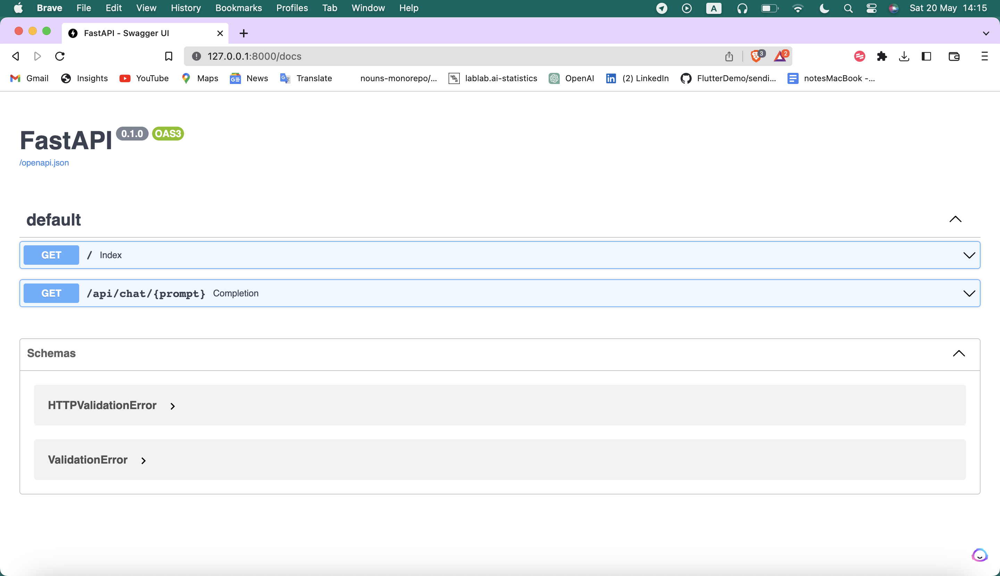
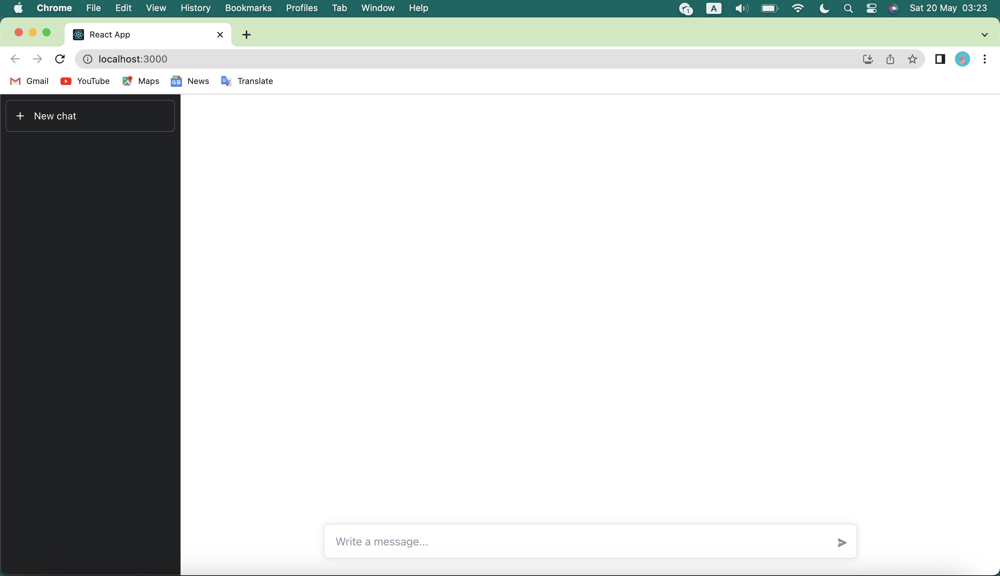

## What is Claude?

[Claude](https://lablab.ai/tech/anthropic/claude) is a next-generation AI assistant based on Anthropic’s research into training helpful, honest, and harmless AI systems. Claude is capable of a wide variety of conversational and text processing tasks while maintaining a high degree of reliability and predictability. Claude can help with use cases including summarization, search, creative and collaborative writing, Q&A, coding, and more.

## What will we do?

In this tutorial we will build FullStack AI Assistant website with Anthropic's Claude + LangChain. We will use [Anthropic's Claude LangChain library](https://python.langchain.com/en/latest/_modules/langchain/llms/anthropic.html), [React](https://react.dev/), [Tailwind CSS](https://tailwindcss.com/) and [Axios](https://axios-http.com/docs/intro). You may also use, either Anthropic's Claude [Python SDK](https://console.anthropic.com/docs/api/libraries#python) or [TypeScript/JavaScript SDK](https://console.anthropic.com/docs/api/libraries#typescript).

### Prerequisites

To use Anthropic’s Claude API you must apply for [early access](https://anthropic.com/earlyaccess)

### Setting up the project

Let's start by creating a new directory:

```bash
mkdir claude_langchain_tutorial
cd claude_langchain_tutorial
```

Cool! 

Now create python vertual environment and activate it:

```code 
python -m venv env

# Linux/MacOS
source venv/bin/activate

# Windows
venv\Scripts\activate.bat
```

## Custom API with FastAPI

We will use [FastAPI](https://fastapi.tiangolo.com/) to create a custom API. Create a new file called `api.py` and add the following code:

```python
from typing import Union
from fastapi import FastAPI
from fastapi.middleware.cors import CORSMiddleware
import os
from dotenv import load_dotenv
from langchain import PromptTemplate, LLMChain
from langchain.chat_models import ChatAnthropic

app = FastAPI()

origins = ['*']

app.add_middleware(
    CORSMiddleware,
    allow_origins=origins,
    allow_credentials=True,
    allow_methods=["*"],
    allow_headers=["*"],
)

@app.get("/")
def index():
    return {"responce": "Hello World!"}


@app.get("/api/chat/{prompt}")
def completion(prompt: str):
    load_dotenv()

    # client = anthropic.Client(os.getenv("ANTHROPIC_API_KEY"))

    promptTemplate = PromptTemplate(
        input_variables=["prompt"],
        template="What is a good name for a company that makes {prompt}",
    )

    anthropic = ChatAnthropic(client=f"{os.getenv('ANTHROPIC_API_KEY')}")

    chain = LLMChain(llm=anthropic, prompt=promptTemplate)

    response = chain.run(prompt)

    return {"prompt": prompt, "response": response}

```

Open a terminal and install the following packages:

```bash
pip install fastapi
pip install "uvicorn[standard]"
pip install python-dotenv
pip install langchain
```

Now create a new file called `.env` and add your API key:

```bash
nano .env
ANTHROPIC_API_KEY=YOUR_API_KEY
```

Save and exit:

```bash
Ctrl + O + Enter
Ctrl + X
```

Run the following command to start the server:

```bash
uvicorn api:app --reload
```

Open a browser and go to `http://127.0.0.1:8000/`. You should see the following:

```json
{"responce": "Hello World!"}
```

Now go to `http://127.0.0.1:8000/docs` you will see the automatic interactive API documentation (provided by [Swagger UI](https://swagger.io/)). 



Click "Try it out" and type `ex: What is a good name for a company that makes colorful socks`. You should see something similar to:

```json
{"prompt": "What is a good name for a company that makes colorful socks", "response": "Colorful Socks"}
```

Amazing! Now we have a custom API. Let's move on to the next step.


## Create React App

First, make sure you have [Node.js](https://nodejs.org/en/) installed on your machine.

Now let's create a React App. Open a new terminal and run the following command:

```bash
npx create-react-app claude-app
```

### Dependencies

Install `tailwindcss` via npm, and create your `tailwind.config.js` file.

```bash
cd claude-app

npm install -D tailwindcss
npx tailwindcss init
```

Install Axios:

```bash
npm install axios
```

Add the paths to all of your template files in your `tailwind.config.js` file.
    
```js
module.exports = {
    purge: ['./src/**/*.{js,jsx,ts,tsx}', './public/index.html'],
    darkMode: false, // or 'media' or 'class'
    theme: {
        extend: {},
    },
    variants: {
        extend: {},
    },
    plugins: [],
}
```

Add the `@tailwind` directives for each of Tailwind’s layers to your main CSS file.
    
```css
@tailwind base;
@tailwind components;
@tailwind utilities;
```


### Design the UI

Go to `src' folder and open `App.jsx` file. Replace the code with the following:

```js
import React, { useEffect, useState } from "react";
import axios from "axios";
import icons from "./icons"; // import icons

const App = () => {
  const [input, setInput] = useState("");
  const [chatItems, setChatItems] = useState([]);
  const [loading, setLoading] = useState(false);


  const completion = async () => {

    setLoading(true);
  
    // Send request to our just cooked API
    axios.defaults.headers.post['Content-Type'] ='application/json; charset=utf-8';
    axios.defaults.headers.post['Access-Control-Allow-Origin'] = '*';
    axios.get(`http://127.0.0.1:8000/api/chat/${input}`)
      .then(res => {
          console.log(res.data);
          if (res.data) {
            setChatItems([
              ...chatItems,
              { content: res.data.response, isAnswer: true },
            ]);
          }
      })
      .catch(err => {
          console.log(err);
      })

      setLoading(false);
    setInput('');
  };

  useEffect(() => {
    if (chatItems.length === 0) return;
    if (chatItems[chatItems.length - 1].isAnswer) return;
    completion();

  }, [chatItems]);

  function handleSubmit(e) {
    e.preventDefault();
    setChatItems([...chatItems, { content: input, isAnswer: false }]);
  }

  // Display the chat messages
  const ChatItem = ({ isAnswer, content }) => {
    return (
      <li className={`flex ${isAnswer ? "justify-start" : "justify-end"}`}>
        <div
          className={`relative max-w-xl px-4 py-2 text-gray-700 rounded shadow ${
            !isAnswer ? "bg-gray-100" : ""
          }`} style={{whiteSpace: 'pre-wrap'}}>
            {content.toString().trim()}
        </div>
      </li>
    );
  };

  return (
    <div className="overflow-hidden w-full z-20 h-full relative">
      <div className="flex h-full flex-1 flex-col md:pl-[260px]">
        <main className="relative h-full w-full transition-width flex flex-col overflow-hidden items-stretch flex-1">
          <div className="flex-1 overflow-auto">
            <div className="stretch mx-2 flex flex-row gap-3 pt-2 last:mb-2 md:last:mb-6 lg:mx-auto lg:max-w-3xl lg:pt-6">
              <ul className="space-y-2 w-full">
                {chatItems.map((item, i) => (
                  <ChatItem
                    key={i}
                    isAnswer={item.isAnswer}
                    content={item.content}
                  />
                ))}
              </ul>
            </div>
          </div>
          <div className="w-full border-t md:border-t-0 dark:border-white/20 md:border-transparent md:dark:border-transparent md:bg-vert-light-gradient bg-white dark:bg-gray-800 md:!bg-transparent dark:md:bg-vert-dark-gradient">
            <form
              onSubmit={handleSubmit}
              className="stretch mx-2 flex flex-row gap-3 pt-2 last:mb-2 md:last:mb-6 lg:mx-auto lg:max-w-3xl lg:pt-6">
              <div className="relative flex h-full flex-1 md:flex-col">
                <div className="ml-1 mt-1.5 md:w-full md:m-auto md:flex md:mb-2 gap-2 justify-center"></div>
                <div className="flex flex-col w-full py-2 pl-3 flex-grow md:py-3 md:pl-4 relative border border-black/10 bg-white dark:border-gray-900/50 dark:text-dark text-dark dark:bg-gray-700 rounded-md shadow-[0_0_10px_rgba(0,0,0,0.10)] dark:shadow-[0_0_15px_rgba(0,0,0,0.10)]">
                  <textarea
                    value={loading ? "" : input}
                    tabIndex="0"
                    rows="1"
                    placeholder="Write a message..."
                    onChange={(e) => setInput(e.target.value)}
                    className="m-0 w-full resize-none border-0 bg-transparent p-0 pr-7 focus:ring-0 focus-visible:ring-0 dark:bg-transparent"></textarea>
                  <button
                    disabled={loading}
                    id="chat-submit"
                    type="submit"
                    className="absolute p-1 rounded-md text-gray-500 bottom-1.5 right-1 md:bottom-2.5 md:right-2 hover:bg-gray-100 dark:hover:text-gray-400 dark:hover:bg-gray-900 disabled:hover:bg-transparent dark:disabled:hover:bg-transparent">
                    {loading ? icons.spinner : icons.sendIcon}
                  </button>
                </div>
              </div>
            </form>
          </div>
        </main>
      </div>
      <div className="dark hidden bg-gray-900 md:fixed md:inset-y-0 md:flex md:w-[260px] md:flex-col">
        <div className="flex h-full min-h-0 flex-col">
          <div className="scrollbar-trigger flex h-full w-full flex-1 items-start border-white/20">
            <nav className="flex h-full flex-1 flex-col space-y-1 p-2">
              <a
                href="/chat"
                className="flex py-3 px-3 items-center gap-3 rounded-md hover:bg-gray-500/10 transition-colors duration-200 text-white cursor-pointer text-sm mb-2 flex-shrink-0 border border-white/20">
                <svg
                  stroke="currentColor"
                  fill="none"
                  strokeWidth="2"
                  viewBox="0 0 24 24"
                  strokeLinecap="round"
                  strokeLinejoin="round"
                  className="h-4 w-4"
                  height="1em"
                  width="1em"
                  xmlns="http://www.w3.org/2000/svg">
                  <line x1="12" y1="5" x2="12" y2="19"></line>
                  <line x1="5" y1="12" x2="19" y2="12"></line>
                </svg>
                  New chat
              </a>
            </nav>
          </div>
        </div>
      </div>
    </div>
  );
};

export default App;
```

Cool!

Now, create new file `icons.jsx` in `src` folder and paste this code:

```jsx
const icons = {
    sendIcon: (
        <svg
          stroke="currentColor"
          fill="currentColor"
          strokeWidth="0"
          viewBox="0 0 20 20"
          className="h-4 w-4 rotate-90"
          height="1em"
          width="1em"
          xmlns="http://www.w3.org/2000/svg">
          <path d="M10.894 2.553a1 1 0 00-1.788 0l-7 14a1 1 0 001.169 1.409l5-1.429A1 1 0 009 15.571V11a1 1 0 112 0v4.571a1 1 0 00.725.962l5 1.428a1 1 0 001.17-1.408l-7-14z"></path>
        </svg>
    ),
    spinner: (
        <div 
          className="spinner-border spinner-border-sm d-flex align-items-center" 
          role="status">
          <span 
            className="visually-hidden">
              Loading...
          </span>
        </div>
    ),
}

export default icons;
```

Go to `css` folder and copy/paste `styles.css` into your `styles.css` file:

Then, import `styles.css` into `index.js` file:

```jsx
import './styles.css';
```

Perfect! You are done with the frontend part!

Now, Run the following command to start the app:

```bash
npm start
```

Open [http://localhost:3000](http://localhost:3000) to view it in the browser.



##Conclusion

In this tutorial, we've learned how to build FullStack AI Assistant website with Anthropic's Claude + LangChain using React, Tailwind CSS, and Axios. The process involved creating a custom API using FastAPI to interact with Anthropic's Claude LangChain library, and implementing a chat interface to enable users to have conversations with the powerful AI assistant.

What’s next?


Participate in the [lablab.ai hackathons](https://lablab.ai/event) and win cool prizes!

Thanks for reading this tutorial.

made with 💜 by [abdibrokhim](https://linkedin.com/in/abdibrokhim) for [lablab.ai tutorials](https://lablab.ai/t).
