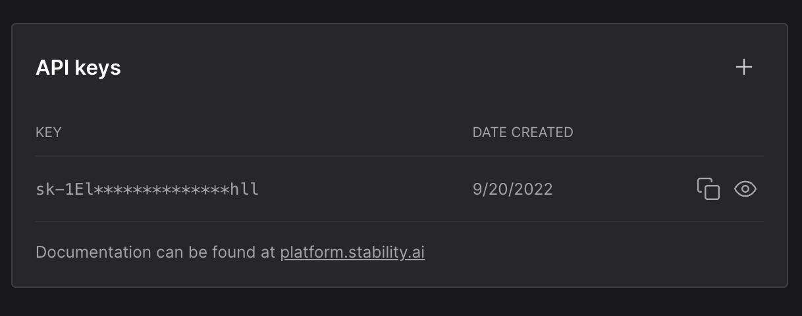

## Introduction
[ChatGPT Plugins](https://platform.openai.com/docs/plugins/introduction), are tools that connect ChatGPT to external applications. These plugins expand ChatGPT's abilities by allowing it to interact with specific APIs created by developers. With the help of these plugins, ChatGPT can perform various tasks such as fetching up-to-date information like sports scores, stock prices, or the latest news. It can also access knowledge bases like company documents or personal notes to retrieve specific information. Additionally, plugins enable ChatGPT to assist users with tasks such as booking a flight or ordering food, providing helpful guidance and support.
[Stable Diffusion](https://stability.ai/stable-diffusion), is a new generative model that can generate high-resolution images with a single forward pass. It is based on the [Diffusion Models](https://arxiv.org/abs/2006.11239) and [StyleGAN2](https://arxiv.org/abs/1912.04958) architectures. It is trained on the [ImageNet](https://image-net.org/) dataset and can generate images up to 1024x1024 resolution. It is also trained on the [Kinetics-700](https://deepmind.com/research/open-source/kinetics) dataset and can generate videos up to 256x256 resolution. It is trained on the [ImageNet](https://image-net.org/) dataset and can generate images up to 1024x1024 resolution. It is also trained on the [Kinetics-700](https://deepmind.com/research/open-source/kinetics) dataset and can generate videos up to 256x256 resolution. It is trained on the [ImageNet](https://image-net.org/) dataset and can generate images up to 1024x1024 resolution. It is also trained on the [Kinetics-700](https://deepmind.com/research/open-source/kinetics) dataset and can generate videos up to 256x256 resolution. It is trained on the [ImageNet](https://image-net.org/) dataset and can generate images up to 1024x1024 resolution. It is also trained on the [Kinetics-700](https://deepmind.com/research/open-source/kinetics) dataset and can generate videos up to 256x256 resolution. It is trained on the [ImageNet](https://image-net.org/) dataset and can generate images up to 1024x1024 resolution. It is also trained on the [Kinetics-700](https://deepmind.com/research/open-source/kinetics) dataset and can generate videos up to 256x256 resolution. It is trained on the [ImageNet](https://image-net.org/) dataset and can generate images up to 1024x1024 resolution. It is also trained on the [Kinetics-700](https://deepmind.com/research/open-source/kinetics) dataset and can generate videos up to 256x256 resolution.


## What we are going to do?
In this tutorial I'm going to be walking you through step by step the super easy process of building a ChatGPT Plugin for image generation with Stable Diffusion. As a bonus, I'll also show you how to integrate your plugin to the ChatGPT.


### Prerequisites
Download [Visual Studio Code](https://code.visualstudio.com/) compatible with your operating system.
To use ChatGPT Plugins API you need [join plugins waitlist](https://openai.com/waitlist/plugins).
Go to [Dream Studio](https://dreamstudio.ai/account), create an account and grab you API key.




### Let's get started

## Step 1 - Create a new project

Let's start by creating new folder for our project. Open Visual Studio Code and create new folder named `chatgpt-plugin-stable-diffusion` by running the following command in the terminal:


```bash
mkdir chatgpt-plugin-stable-diffusion
cd chatgpt-plugin-stable-diffusion
```


In order to plugin work properly, we need to go through following steps:
* Building an API (Flask, FastAPI, etc.) that implements the OpenAPI specification
* Creating the JSON manifest file that will define relevant metadata for the plugin
* Documenting the API in the OpenAPI yaml or JSON format


### Step 2 - API implementation

As a first step we should implement the API. In this tutorial, I will use [Flask](https://flask.palletsprojects.com/en/2.3.x/), a lightweight WSGI web application framework. It is designed to make getting started quick and easy, with the ability to scale up to complex applications. However, you are free to use any other framework like: [FastAPI](https://fastapi.tiangolo.com/), [Django](https://www.djangoproject.com/), [Starlette](https://www.starlette.io/), etc.

Let's create new file named `app.py`. Open the terminal and run the following command:

```bash
touch app.py
```

It's time to install the required dependencies:

```bash
pip install flask 
pip install stability-sdk
```

Now, we can start implementing the API. First, we need to import the required dependencies:

```python
from flask import Flask, request, jsonify, send_file, Response
from stability_sdk import client
import stability_sdk.interfaces.gooseai.generation.generation_pb2 as generation
import base64
```

Next, we need to set up the Flask app and the Stable Diffusion API client:

```python
# Set up the Flask app
app = Flask(__name__)

# Set up the Stable Diffusion API client
stability_api = client.StabilityInference(
    key='',  # Replace with your Stability API key
    verbose=True,  # Set to True to enable verbose logging
    engine="stable-diffusion-xl-beta-v2-2-2"  # Replace with the engine you want to use
)
```

And last but not least, we need to define the API endpoint for generating images:

```python
# Define the API endpoint for generating images
@app.route('/generate-image', methods=['POST'])
def generate_image():

    # Get the prompt and other parameters from the request
    data = request.json  # Get the request payload
    prompt = data.get('prompt')  # Prompt to generate the image from
    seed = data.get('seed', None)  # Set to None to use a random seed
    steps = data.get('steps', 30)  # Number of steps to run the diffusion for
    cfg_scale = data.get('cfg_scale', 8.0)  # Scale of the diffusion model
    width = data.get('width', 512)  # Width of the generated image
    height = data.get('height', 512)  # Height of the generated image
    samples = data.get('samples', 1)  # Number of samples to generate

    # Generate the image using Stable Diffusion
    answers = stability_api.generate(  # Call the generate() method
        prompt=prompt,
        seed=seed,
        steps=steps,
        cfg_scale=cfg_scale,
        width=width,
        height=height,
        samples=samples,
        sampler=generation.SAMPLER_K_DPMPP_2M
    )

    # Retrieve the generated image(s) from the response
    generated_images = []
    for resp in answers:
        for artifact in resp.artifacts:
            if artifact.type == generation.ARTIFACT_IMAGE:
                encoded_image = base64.b64encode(artifact.binary).decode('utf-8')
                generated_images.append(encoded_image)

    # Return the generated image(s) as the API response
    return jsonify(images=generated_images)


# Run the Flask app
if __name__ == '__main__':
    # Set debug=True to enable auto-reloading when you make changes to the code
    app.run(debug=True, host='127.0.0.1', port=5000)
```

Prefect! Now we can run the Flask app and test the API endpoint:

Create new `test.py` file and paste following code:

```python
import requests
import json
import base64

# Define the API endpoint URL
url = 'http://127.0.0.1:5000/generate-image'

# Set up the request payload
payload = {
    'prompt': 'a donut',
    'seed': 992446758,
    'steps': 30,
    'cfg_scale': 8.0,
    'width': 512,
    'height': 512,
    'samples': 1
}

# Send the POST request to generate the image
response = requests.post(url, json=payload)

# Check the response status code
if response.status_code == 200:
    # Get the generated images from the response
    data = response.json()
    generated_images = data['images']

    # Process the generated images
    for i, encoded_image in enumerate(generated_images):
        # Decode the base64-encoded image
        decoded_image = base64.b64decode(encoded_image)

        # Save the image to a file
        image_filename = f'generated_image_{i}.png'
        with open(image_filename, 'wb') as image_file:
            image_file.write(decoded_image)

        print(f'Saved generated image {i+1} as {image_filename}')
else:
    print(f'Request failed with status code {response.status_code}')
```

Don't forget to install `requests` library by running `pip install requests` in your terminal.

Now, run the Flask app: `python app.py`. Make sure the Flask app is running correctly, then open new terminal and run the test script: `python test.py`. After, a couple of seconds you should see the generated image in your folder.


Amazing! We've successfully built the API for image generation with Stable Diffusion. Now, we can use this API to build a ChatGPT Plugin for image generation.


### Step 3 - Plugin manifest
Every plugin requires a `ai-plugin.json` file, which will be hosted later, on the API’s domain. [Read more](https://platform.openai.com/docs/plugins/getting-started/plugin-manifest).

Create new file named `ai-plugin.json` and paste following code:

```json
{
    "schema_version": "v1",
    "name_for_human": "Image Generation Plugin",
    "name_for_model": "image-generation",
    "description_for_human": "Plugin for generating high-quality images using Stable Diffusion.",
    "description_for_model": "Plugin for generating high-quality images using Stable Diffusion.",
    "auth": {
        "type": "none"
    },
    "api": {
        "type": "openapi",
        "url": "http://127.0.0.1:5000/openapi.yaml"
    },
    "logo_url": "http://127.0.0.1:5000/logo.png",
    "contact_email": "support@example.com",
    "legal_info_url": "https://example.com/legal"
}

```

### Step 4 - OpenAPI specification

The OpenAPI specification is a standard for describing REST APIs. It is used to define the API that the plugin will use to communicate with the model. [Read more](https://platform.openai.com/docs/plugins/getting-started/openapi-definition).

Create new file named `openapi.yaml` and paste following code:

```yaml
openapi: 3.0.1
info:
  title: Image Generation Plugin
  description: A plugin that generates high-quality images using Stable Diffusion.
  version: "v1"
servers:
  - url: http://127.0.0.1:5000
paths:
  /generate-image:
    post:
      operationId: generateImage
      summary: Generate an image
      requestBody:
        required: true
        content:
          application/json:
            schema:
              $ref: "#/components/schemas/generateImageRequest"
      responses:
        "200":
          description: OK
          content:
            application/json:
              schema:
                $ref: "#/components/schemas/generateImageResponse"

components:
  schemas:
    generateImageRequest:
      type: object
      required:
        - prompt
      properties:
        prompt:
          type: string
          description: The prompt for image generation.
          required: true
        seed:
          type: integer
          description: The seed for deterministic generation.
    generateImageResponse:
      type: object
      properties:
        images:
          type: array
          items:
            type: string
          description: The generated image(s) in base64 format.
```


Now, go back `app.py` file and add rest of the code:


```python
# Define the API endpoint for the plugin logo
@app.route('/logo.png', methods=['GET'])
def plugin_logo():
    filename = 'logo.png'
    return send_file(filename, mimetype='image/png')


# Define the API endpoint for the plugin manifest
@app.route('/ai-plugin.json', methods=['GET'])
def plugin_manifest():
    host = request.headers['Host']
    with open('./ai-plugin.json') as f:
        text = f.read()
        return Response(text, mimetype='text/json')


# Define the API endpoint for the OpenAPI specification
@app.route('/openapi.yaml', methods=['GET'])
def openapi_spec():
    host = request.headers['Host']
    with open('./openapi.yaml') as f:
        text = f.read()
        return Response(text, mimetype='text/yaml')
```

All done! Now that you have all of this done you've completed all of the four steps you have a server that's up and running with your functionality ready to be talked to now comes the step of actually integrating it with ChatGPT.

Open [https://chat.openai.com/](https://chat.openai.com/)`, go over to the `plugin store` > `develop your own plugin` and then click `my manifest is ready`, copy/paste the base link to our app which is `https://127.0.0.1:5000` in our case. Then click `find manifest file` > `next` > `install for me` > `continue` and `install plugin`.


## Conclusion!


In this tutorial, we've learned how to to build ChatGPT Plugin for image generation with Stable Diffusion. 

Be part of the AI enthusiasts community and learn more about AI and its potential!

Thanks for reading this tutorial.

made with 💜 by [abdibrokhim](https://linkedin.com/in/abdibrokhim) for [lablab.ai tutorials](https://lablab.ai/t).

