## Introduction
[Chirp]() is Google Cloud's 2B-parameter speech model built via self-supervised training on millions of hours of audio and [28 billion sentences of text spanning 100+ languages](https://ai.googleblog.com/2023/03/universal-speech-model-usm-state-of-art.html). Chirp delivers 98% speech recognition accuracy in English and over 300% relative improvement in several languages with less than 10M speakers. 

## What we are going to do?
In this tutorial, we will learn how to effortlessly set up Google Cloud console to leverage the powerful Chirp speech-to-text AI model. This comprehensive tutorial provides step-by-step guide for an easy setup process and a quick start to use Chirp speech-to-text AI model. Sit back, relax, enjoy the tutorial and don't forget to make a cup of coffee ☕️.

### Learning outcomes
- How to use Google Cloud console.
- How to set up Google's Chirp speech-to-text AI model on Google Cloud console.

### We will cover the following steps:

1. Creating a Google Cloud account.
2. Creating a new project on the Google Cloud console.
3. Enabling the Speech API.
4. Creating an STT (Speech-to-Text) Recognizer using the Chirp model.
5. Creating a new Workspace for the project.
6. Performing a transcription on an audio file.
7. Viewing and downloading the transcription results.

### Prerequisites
Nothing! Just a cup of coffee ☕️ and a laptop 💻.

## Getting started

### Step 1: Create a Google Cloud account

First, we need to create a Google Cloud account. If you already have one, you can skip this step and [go here](https://cloud.google.com/). If you don't have one, you can create a free account [go here](https://cloud.google.com/free).

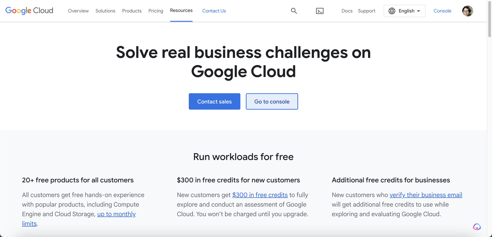

### Step 2: Create a new project

Next, we need to create a new project. On the top left corner click on the `project dropdown menu` > `New Project`.

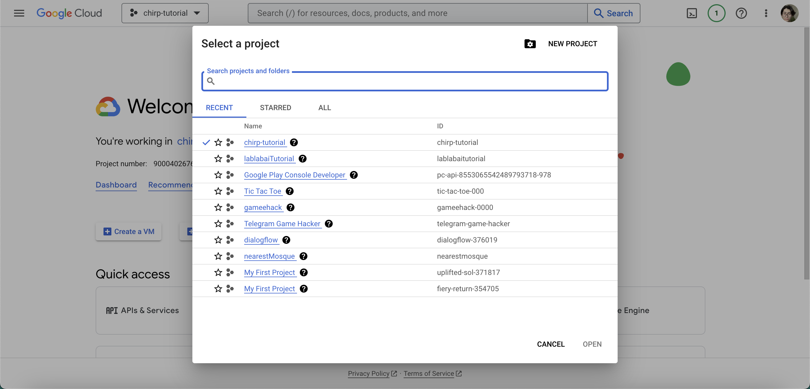

Give your project a name and click `Create`.

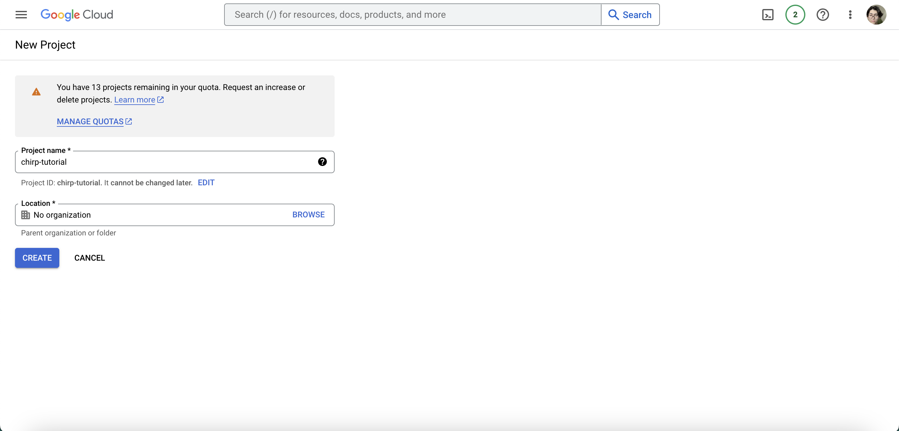

### Step 3: Enable API

Go to [Speech](https://console.cloud.google.com/speech) in Google Cloud console. Click `ENABLE API`.

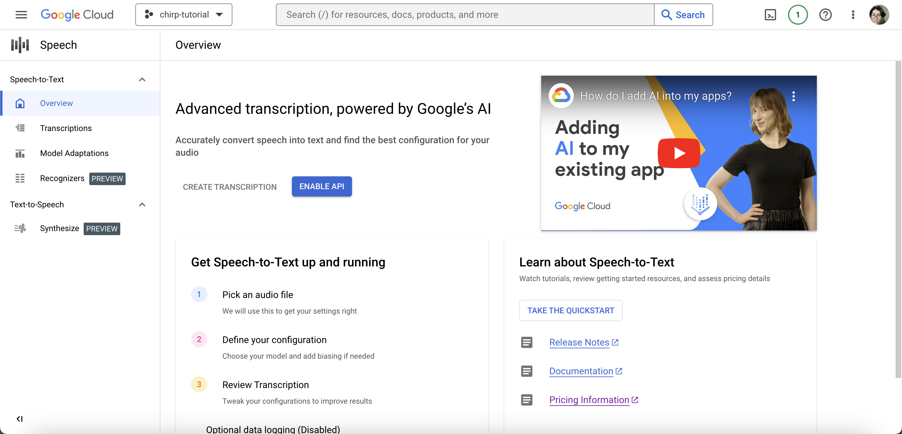

### Step 4: Create an STT Recognizer

Go over left sidebar navigation and click `Recognizers` > `CREATE RECOGNIZERS`. 

Give your recognizer a name `chirp-recognizer`. Select `Chirp` as the model. Select the language `en-US` in our case, leave the rest of the settings as default and click `Save`.

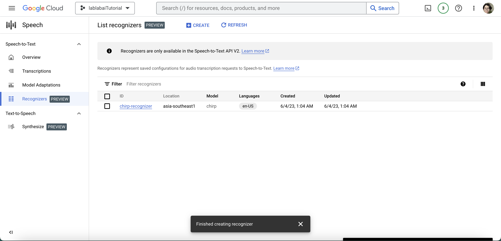

### Step 5: Create a new Workspace

Now, we need to create a new Workspace for our project. Go to `Workspace dropdown menu` and click `New Workspace`. You should see a sidebar pops up on the right side of your screen. 

From the Create a new workspace navigation sidebar, click `Browse` > `Create a new bucket`. Give your bucket a name `chirp-bucket` and click `Continue`.

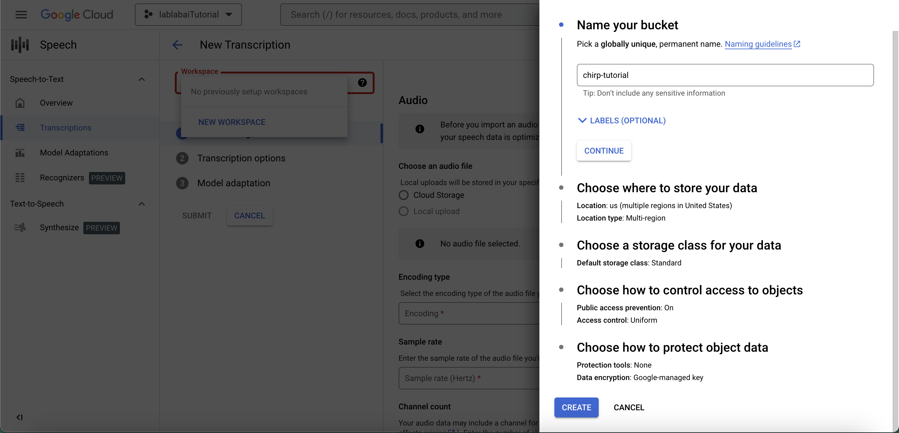

Note: Rest of the settings are optional, you can leave them as default. 

Click `Create` and you should see a new bucket is created as shown below.

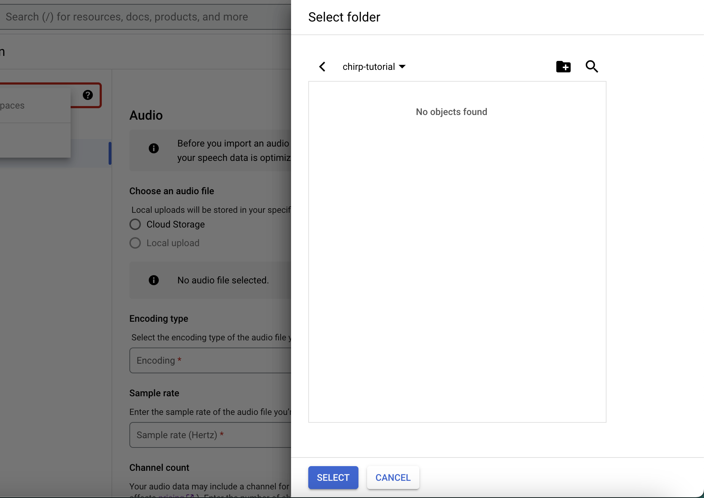

Then, click `Select` > `Continue` > `Create` to finish creating your workspace for the speech-to-text UI.

Perfet! Now, we have a workspace for our speech-to-text UI. Let's move on to the next step.

### Step 6: Create a new Transcription

Let's perform a transcription on our actual audio file. 

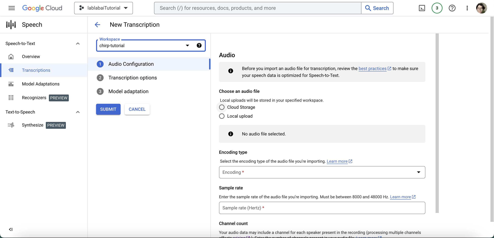

Go over left sidebar navigation and click `Transcription` > `New Transcription`. From the `New Transcription` page, select your audio file through either uploading audio files `Local upload` or specifying an existing Cloud Storage file `Cloud storage`. 

In this tutorial, we will use `Local upload` option and [this](./audio/ElevenLabs_2023-05-26T12_34_02.000Z_Adam_FjVs58vot1BUeNaRj635.mp3) audio file.

Note: The UI will assess your audio file parameters automatically, and you can also specify them manually.

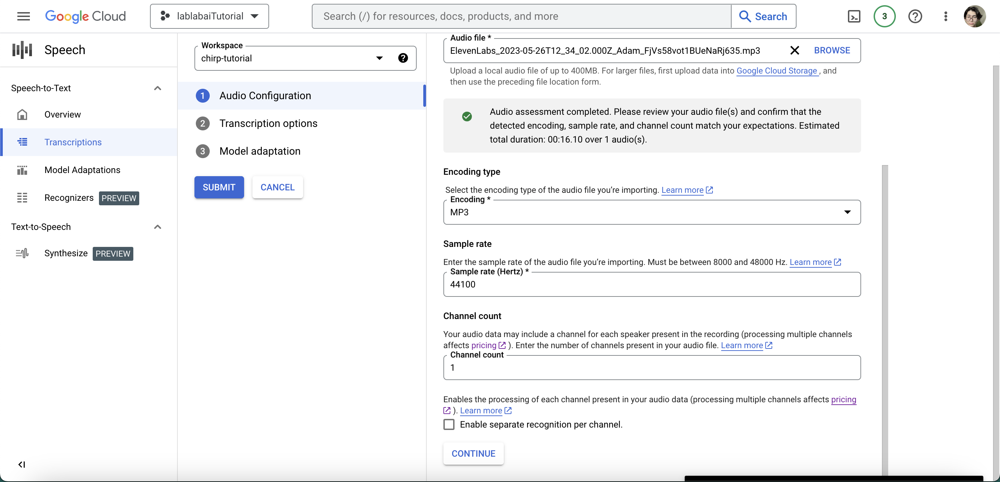

Click `Continue`. 

By default API version is set to `V1`, change it to `V2`, specify the language `English (United States) - en-US` in our case spoken in the audio file from the `dropdown menu`, then choose `Chirp` as transcription model and our newly created `chirp-recognizer` as the recognizer.

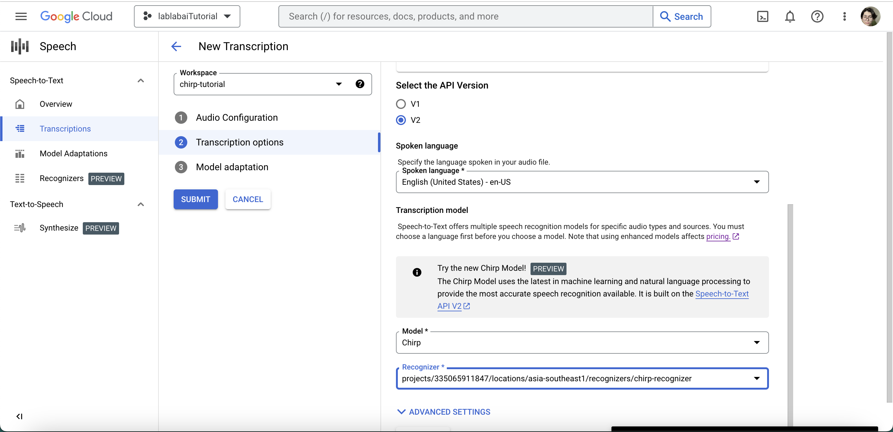

Click `Submit` and wait for a few seconds.

### Step 7: View Transcription Results and Download

To see the transcription results, click `the name of your transcription`.

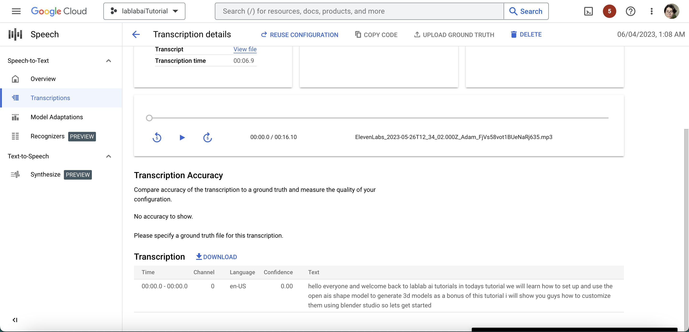

You may also download the transcription results in 4 different formats: `JSON`, `TXT`, `SRT`, and `CSV`. Let's download the transcription results in `TXT` format. Click `Download` > `TXT` > `Download.

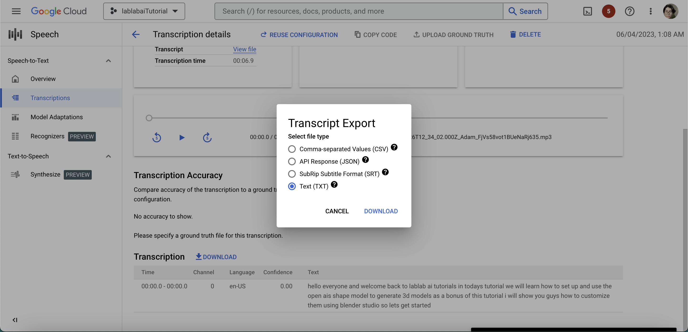

## Conclusion

This tutorial has walked you through the process of setting up and using Google's Chirp speech-to-text AI model on the Google Cloud console. By following the step-by-step instructions, you can easily leverage the power of Chirp for accurate speech recognition.

I hope this tutorial provided clear and detailed guidance, accompanied by few screenshots, to ensure a seamless setup process. Whether you are new to Google Cloud or an experienced user, the tutorial aims to make the process accessible and user-friendly.

By the end of this tutorial, I'm sure you have gained the knowledge and skills to utilize Google's Chirp speech-to-text AI model. By the way, I encourage you to explore the potential of Chirp in your projects and applications, and feel free to experiment with different languages and audio files.

Thank you for following along with this tutorial.

If you have any questions, feel free to reach out to me on [LinkedIn](https://linkedin.com/in/abdibrokhim) or [Twitter](https://twitter.com/abdibrokhim). I'd love to hear from you!

made with 💜 by [abdibrokhim](https://linkedin.com/in/abdibrokhim) for [lablab.ai tutorials](https://lablab.ai/t).

