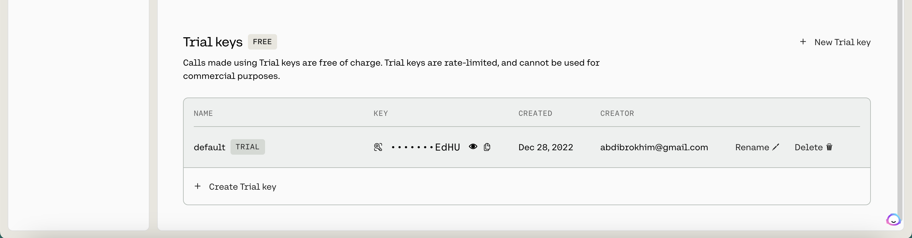
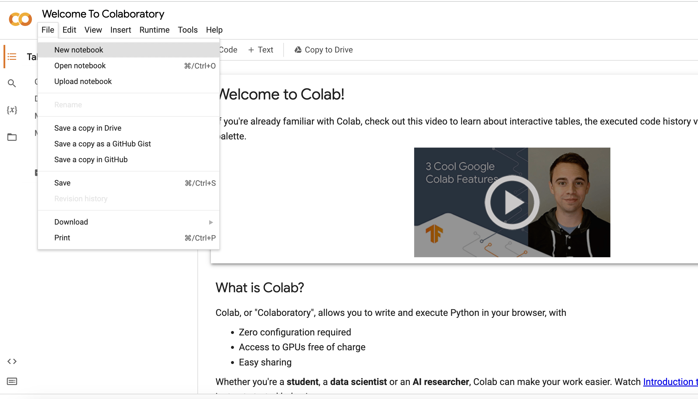
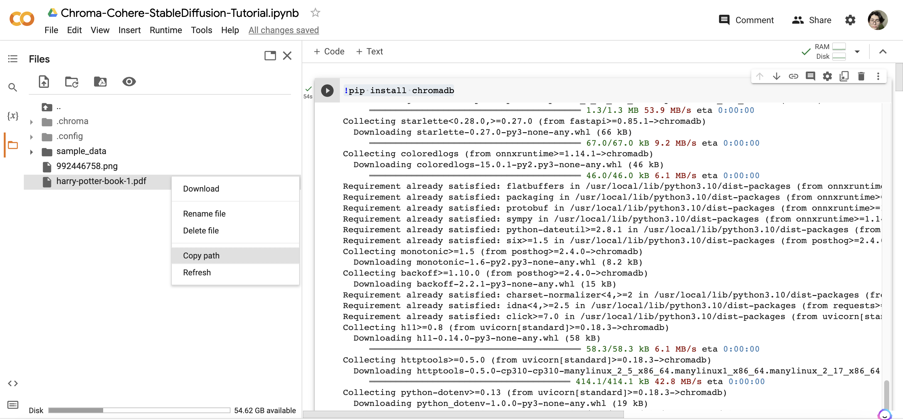
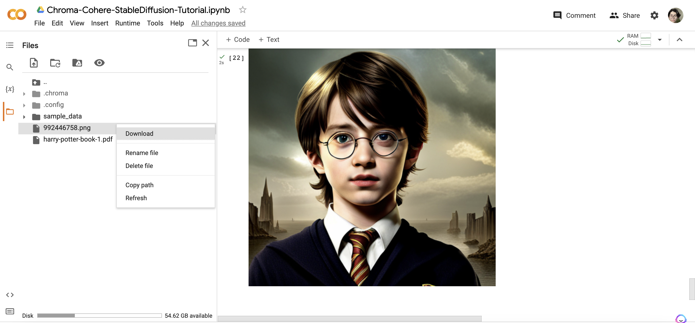
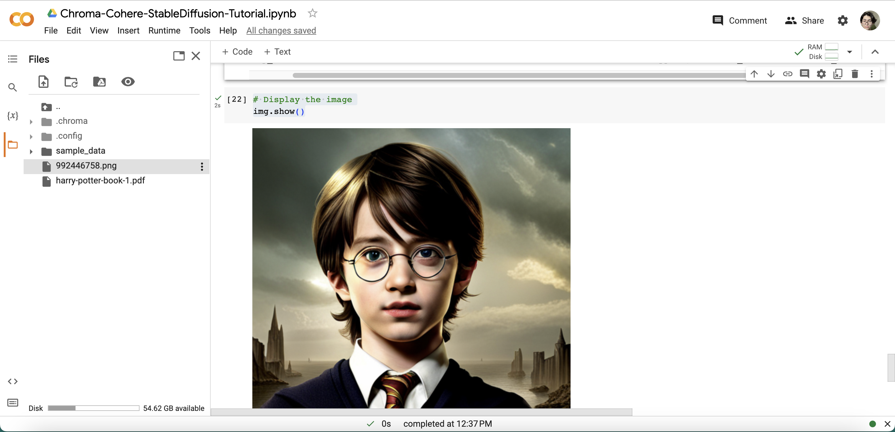

## Introduction
[Chroma](https://www.trychroma.com/), is the AI-native open-source embedding database. Chroma makes it easy to build LLM apps by making knowledge, facts, and skills pluggable for LLMs [read more...](https://docs.trychroma.com/).

[Cohere](https://cohere.ai/), is a platform that allows you to build AI-powered applications with just a few lines of code. Cohere's API allows you to build a wide range of applications, including chatbots, question answering systems, and summarization tools [read more...](https://cohere.com/embed).

[Stable Diffusion](https://stability.ai/stable-diffusion), is a new generative model that can generate high-resolution images with a single forward pass.


## What we are going to do?
In this tutorial, I will show you guys how to use Chroma DB and Cohere embeddings to alive the personas from books using Stable Diffusion image generation model. Sit back, relax and enjoy the tutorial! Don't forget to make a cup of coffee, it may take a while to generate an image.

To make it more clear and understandable, Lemme split the tutorial into two parts:
- Part 1 - Getting prompt for Stable Diffusion. In this part, we will go through Chroma DB and Cohere LLM. We will load the document, split it into smaller chunks, embed them using Cohere and then we will use Chroma to query the database and get the prompt to use in Part 2.
- Part 2 - Generating images using Stable Diffusion. In this part, we will go through Stable Diffusion SDK and implement the code to generate images based on the prompt we got from Chroma DB in Part 1.

### Prerequisites
To use Cohere embeddings we need API key, go to [Cohere](https://cohere.ai/), on the top right corner click `TRY NOW`, login or create an account and `copy/save` your API key.


To use Stable Diffusion we need API Key, go to [Dream Studio](https://dreamstudio.ai/account), on the top right corner click `GET STARTED`, login or create an account and `copy/save` your API key.




## Getting started

### Create a new project

Let's start by creating new Notebook in Google Colab. Go to [Google Colab](https://colab.research.google.com/) > `File` and click `New notebook`.



It will open a new Notebook in a new tab, give it a name by clicking on `Untitled0` and rename it to `Chroma Stable Diffusion Tutorial` or whatever you want.


Great, we are ready to start CODING!.


### Install dependencies

Add new `code cell`. You can do it by clicking `+ Code` button or by shortcut `CMD/CTRL + M B`.

Install the necessary libraries wich we gonna use throughout the tutorial:

```python

!pip install chromadb
!pip install langchain
!pip install pymupdf
!pip install cohere
!pip install stability-sdk

```

Click `Run` button or `CMD/CTRL + Enter`, it will run the active `code cell` and take a few minutes to install all the necessary libraries. Make sure that you have stable internet connection.

Now, if everything is installed correctly, we can move on to the next step.


### Import dependencies

Add new `code cell`.

Here we will import all the necessary libraries, `copy/paste` the following lines of code:
    
```python

from langchain.vectorstores import Chroma  # Chroma vector store
from langchain.embeddings import CohereEmbeddings  # Cohere embeddings
from langchain.text_splitter import RecursiveCharacterTextSplitter  # Recursive character text splitter
from langchain.llms import Cohere  # Cohere LLM
from langchain.chains import VectorDBQA  # VectorDBQA chain
from langchain.document_loaders import PyMuPDFLoader  # PyMuPDF document loaders. Read more: https://pymupdf.readthedocs.io/en/latest/
import os
import io
import warnings
from PIL import Image
from stability_sdk import client  # Stability SDK
import stability_sdk.interfaces.gooseai.generation.generation_pb2 as generation

```

Click `Run` or `CMD/CTRL + Enter`. 

When you run the cell, you may see a `warning message/messages`. Don't worry about it. We can ignore it.

Note: You don't need to save the Notebook every time after running the `code cell`, Google Colab will automatically save it for you. But, if you want to save it manually, you can do it by clicking `File` > `Save` or by shortcut `CMD/CTRL + S`.


### Export environment variables:

Add new `code cell`.

```python

os.environ["COHERE_API_KEY"]

os.environ['STABILITY_HOST'] = 'grpc.stability.ai:443'
os.environ["STABILITY_KEY"]

```

Click `Run` or `CMD/CTRL + Enter`.


### Part 1 - Getting prompt for Stable Diffusion


Firstly, let's quickly upload the book to Google Colab. In this tutorial, we will go with `Harry Potter and the Sorcerer's Stone`. You can download the PDF version [here](https://www.pdfdrive.com/the-complete-harry-potter-harry-potter-and-the-sorcerers-stone-harry-potter-and-the-chamber-of-secrets-harry-potter-and-the-prisoner-of-azkaban-harry-potter-and-the-goblet-of-fire-harry-potter-and-the-order-of-the-phoenix-h-d157198854.html). 

After, downloading back to Google Colab, go to `Files` tab on the left side of the screen, click `Upload to session storage` and upload the file. Wait until the book is uploaded and then `copy` the path.




Now, we can load the file.

Add new `code cell`.

```python

loader = PyMuPDFLoader('/content/harry-potter-book-1.pdf')  # Replace with your file path
documents = loader.load()

```

Click `Run` or `CMD/CTRL + Enter`.


Let's split the document into smaller chunks. 

Why? We should to make sure that the LLM can process the file. If the file is too long, the LLM will not be able to process it.

Add new `code cell`.

```python

text_splitter = RecursiveCharacterTextSplitter(chunk_size=1000, chunk_overlap=0)
texts = text_splitter.split_documents(documents)

```

Click `Run` or `CMD/CTRL + Enter`.


Next, we will create a vector store.

Add new `code cell`.

```python   

embeddings = CohereEmbeddings(cohere_api_key=os.environ["COHERE_API_KEY"])  # Create Cohere embeddings
vectordb = Chroma.from_documents(texts, embeddings)  # Create Chroma vector store

```

Click `Run` or `CMD/CTRL + Enter`.


Now, we should create chain. 

Add new `code cell`.

```python   

qa = VectorDBQA.from_chain_type(llm=Cohere(cohere_api_key=os.environ["COHERE_API_KEY"]), chain_type="stuff", vectorstore=vectordb)  # Create QA chain

```

Click `Run` or `CMD/CTRL + Enter`.


Perfect! We have done with chain. Now, we can query based on the processed book. Let's try to ask a about `Harry Potter`.

Add new `code cell` and `copy/paste` the following lines of code:

```python   

query = "Can you tell me more about Harry Potter's style, behaviour and character"  # Feel free to change the query to your own
qa.run(query)

```

Click `Run` or `CMD/CTRL + Enter`.

You should see something like in image below, but don't worry if you see something different.


### Part 2 - Generating image using Stable Diffusion

Now, we will generate an image using Stable Diffusion. We will use `Stability SDK` to generate an image. Let's create a `Stability SDK` client.

Add new `code cell`.

```python   

# Set up our connection to the API.
stability_api = client.StabilityInference(
    key=os.environ['STABILITY_KEY'], # API Key reference.
    verbose=True, # Print debug messages.
    engine="stable-diffusion-xl-beta-v2-2-2", # Set the engine to use for generation.
    # Available engines: stable-diffusion-v1 stable-diffusion-v1-5 stable-diffusion-512-v2-0 stable-diffusion-768-v2-0
    # stable-diffusion-512-v2-1 stable-diffusion-768-v2-1 stable-diffusion-xl-beta-v2-2-2 stable-inpainting-v1-0 stable-inpainting-512-v2-0
)

```

Click `Run` or `CMD/CTRL + Enter`.


Next, paste the prompt you got from the `Chroma` chain in Part 1.

Add new `code cell`.

```python   
prompt = """

Harry Potter is a boy wizard in training who has to learn how to
perform magic spells, and his character is that of a polite, kind and determined
individual.  Harry is described as being tall and thin, with large glasses and
long, thin, unkempt hair.  He is an extremely polite and friendly person, and
is always willing to help out other people.  Harry is also described as being
determined, and will not give up easily when faced with a challenge.  As he
learns how to perform magic spells, he becomes more confident in his abilities
and his character develops into a more confident and mature person.  Harry is
said to have a kind and caring personality, and is always willing to help out
other people.  Harry is also described as being a brave and determined individual
who will not give up easily when faced with a challenge.  He is described as
being a very intelligent and witty individual who is always willing to help
out other people

"""  # You may replace with your prompt or use the one provided here.

```

Click `Run` or `CMD/CTRL + Enter`.


Now, we can generate an image, based on the prompt.

Add new `code cell`.

```python   

# Set up our initial generation parameters.
answers = stability_api.generate(
    prompt=prompt, # The prompt to generate from.
    seed=992446758, # If a seed is provided, the resulting generated image will be deterministic.
                    # What this means is that as long as all generation parameters remain the same, you can always recall the same image simply by generating it again.
                    # Note: This isn't quite the case for CLIP Guided generations, which we tackle in the CLIP Guidance documentation.
    steps=30, # Amount of inference steps performed on image generation. Defaults to 30.
    cfg_scale=8.0, # Influences how strongly your generation is guided to match your prompt.
                # Setting this value higher increases the strength in which it tries to match your prompt.
                # Defaults to 7.0 if not specified.
    width=512, # Generation width, defaults to 512 if not included.
    height=512, # Generation height, defaults to 512 if not included.
    samples=1, # Number of images to generate, defaults to 1 if not included.
    sampler=generation.SAMPLER_K_DPMPP_2M # Choose which sampler we want to denoise our generation with.
                                                # Defaults to k_dpmpp_2m if not specified. Clip Guidance only supports ancestral samplers.
                                                # (Available Samplers: ddim, plms, k_euler, k_euler_ancestral, k_heun, k_dpm_2, k_dpm_2_ancestral, k_dpmpp_2s_ancestral, k_lms, k_dpmpp_2m, k_dpmpp_sde)
)

```

Click `Run` or `CMD/CTRL + Enter`.

It will take a while to generate an image. Once it's done, we can save the image.


Add new `code cell` and `copy/paste` the following lines of code:

It will save the image with the `seed number` as the filename in the same directory as this notebook.

```python   

# Set up our warning to print to the console if the adult content classifier is tripped.
# If adult content classifier is not tripped, save generated images.
for resp in answers:
    for artifact in resp.artifacts:
        if artifact.finish_reason == generation.FILTER:
            warnings.warn(
                "Your request activated the API's safety filters and could not be processed."
                "Please modify the prompt and try again.")                  
        if artifact.type == generation.ARTIFACT_IMAGE:
            img = Image.open(io.BytesIO(artifact.binary))
            img_path = img.save(str(artifact.seed)+ ".png") # Save our generated images with their seed number as the filename.

```

Click `Run` or `CMD/CTRL + Enter`.

Now, you can download the image and see the image instantly.



Add new `code cell`.

```python   

# Display the image
img.show()

```

Click `Run` or `CMD/CTRL + Enter`.




Congratulations! You've successfully alived persona using Stable Diffusion with the prompt generated by Chroma based on the Cohere embeddings.


## Summary

Throughout the tutorial, we used various tools and libraries, including Chroma, Cohere embeddings, PyMuPDFLoader, Stability SDK, and the PIL library for image manipulation. We also discussed the prerequisites, which include obtaining API keys for Cohere and Stable Diffusion.

By following this tutorial, you should now have a better understanding of how to leverage Chroma DB and Cohere embeddings to generate images using Stable Diffusion. Feel free to explore further and experiment with different books and settings to generate unique and creative images.

Remember to refer to the respective documentation for Chroma, Cohere, and Stable Diffusion for more in-depth information and advanced usage. You can find them above in the Introduction. 

Happy generating!

Thank you for following along with this tutorial, and I hope you learn something new today. If you have any questions, feel free to reach out to me on [LinkedIn](https://linkedin.com/in/abdibrokhim) or [Twitter](https://twitter.com/abdibrokhim). I'd love to hear from you!

made with 💜 by [abdibrokhim](https://linkedin.com/in/abdibrokhim) for [lablab.ai tutorials](https://lablab.ai/t).

