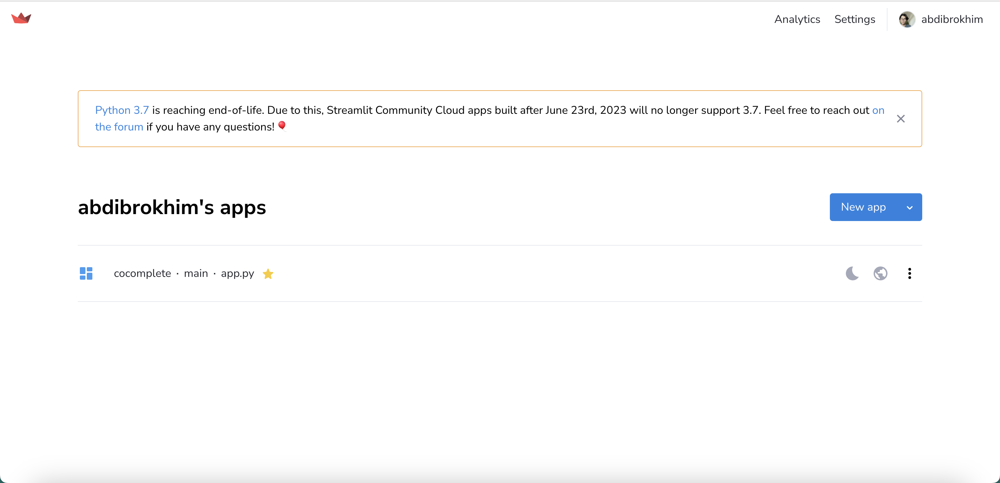
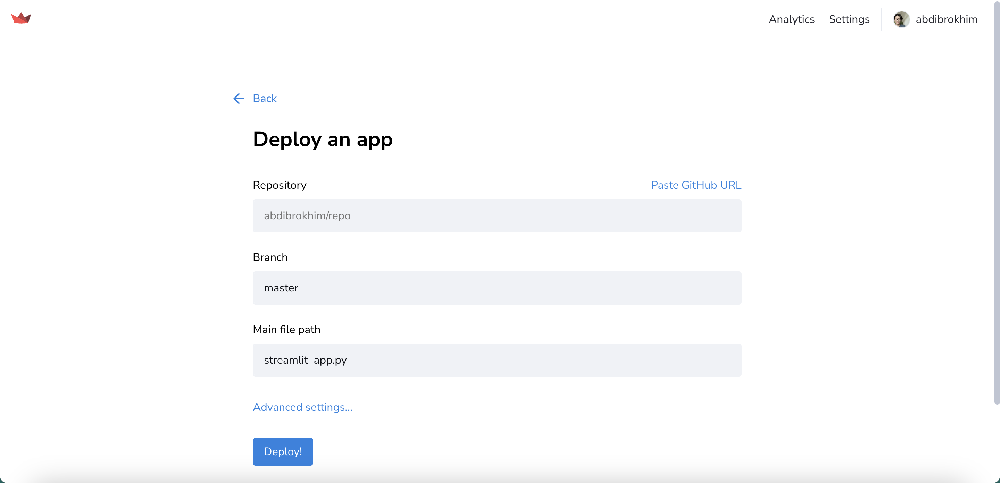
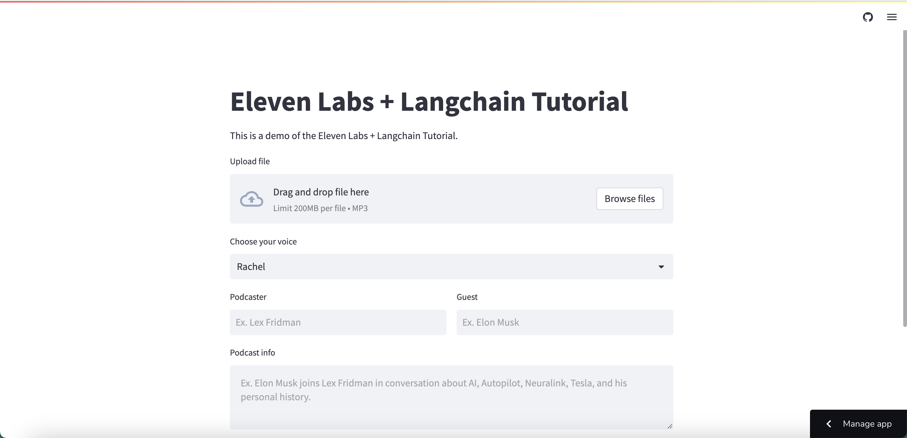

## Introduction
[ElevenLabs](https://beta.elevenlabs.io/about) is voice technology research company, developing the most compelling AI speech software for publishers and creators.

[Langchain](https://python.langchain.com/en/latest/index.html) is a framework for developing applications powered by language models.

[ChatGPT](https://openai.com/chatgpt) is an AI-based chatbot developed by OpenAI. It is powered by the GPT-3.5 architecture, which stands for "Generative Pre-trained Transformer 3.5." GPT-3.5 is an advanced language model that has been trained on a massive amount of text data from the internet and other sources.

[Streamlit](https://streamlit.io/) is pure Python framework for building web apps.


## What are we going to build?
In this tutorial, we will build and deploy a Podcast Generation app using ElevenLabs and Langchain. We will use Streamlit (pure Python framework) to build the web app.
Sit back, relax, enjoy the tutorial and don't forget to make a cup of coffee ☕️.


### Learning outcomes
- Get familiar with ElevenLabs.
- Get familiar with Langchain framework and OpenAI's ChatGPT-3.5-turbo (LLM).
- How to use Streamlit.
- How to build web apps using Streamlit (pure Python framework).
- Deploy the app on Streamlit Sharing Cloud.


### Prerequisites
Download [Visual Studio Code](https://code.visualstudio.com/) compatible with your operating system, or use any other code editor like: [IntelliJ IDEA](https://www.jetbrains.com/idea/), [PyCharm](https://www.jetbrains.com/pycharm/), etc.

To use ElevenLabs, we need API key. Go to [ElevenLabs](https://beta.elevenlabs.io/about) and create an account. It's free! 🎉. And in the upper right corner click on your `profile picture` > `profile`. Next click on the eye icon and `copy/save` your API key.

To use OpenAI's ChatGPT-3.5-turbo, we need API key. Go to [OpenAI](https://beta.openai.com/) and create an account. It's free! 🎉. And in the upper right corner click on your `profile picture` > `View API Keys`. Next click on the `Create new secret key` and `copy/save` your API key.

To deploy our app on Streamlit, we need create an account. Go to [Streamlit](https://streamlit.io/) and create an account. It's also free! 🎉. I recommend, to use your GitHub account to create an account on Streamlit, so later you can deploy your app on Streamlit Sharing Cloud.

Nothing more! Just a cup of coffee ☕️ and a laptop 💻.


## Getting started


### Step 1 - Create a new project

Let's start by creating new folder for our project. Open Visual Studio Code and create new folder named `elevenlabs-langchain-tutorial`:

```bash
mkdir elevenlabs-langchain-tutorial
cd elevenlabs-langchain-tutorial
```

### Step 2 - Create a virtual environment and activate it

Next, we need to create a virtual environment and activate it. To do this, run the following command:

```bash
python3 -m venv venv

# on MacOS and Linux:
source venv/bin/activate

# on Windows:
venv\Scripts\activate
```

### Step 3 - Install all dependencies

Now, we need to install all dependencies. To do this, run the following command:

```bash
pip install elevenlabs
pip install langchain
pip install openai
pip install streamlit
```

### Step 4 - Implementing podcast generation

In this step, we will use [Langchain OpenAI's ChatGPT-3.5-turbo](https://python.langchain.com/en/latest/modules/models/chat/integrations/openai.html) to generate podcast based on the specific topic, podcaster and guest. 

Let's create a new file named `_langchain.py` and add the following code:


```python
# Here we are importing the necessary classes, functions from langchain library.
import openai
from langchain.prompts import (
    ChatPromptTemplate, 
    MessagesPlaceholder, 
    SystemMessagePromptTemplate, 
    HumanMessagePromptTemplate
)
from langchain.chains import ConversationChain
from langchain.chat_models import ChatOpenAI
from langchain.memory import ConversationBufferMemory
import os


# Here we are setting up the OpenAI API key.
os.environ['OPENAI_API_KEY'] = 'api-key'


# Here we are creating a prompt template for the conversation. 
# The prompt template is a list of messages that will be used to generate the conversation.
prompt = ChatPromptTemplate.from_messages([
    SystemMessagePromptTemplate.from_template("The following is a friendly conversation between a human and an AI. The AI is talkative and provides lots of specific details from its context. If the AI does not know the answer to a question, it truthfully says it does not know."),
    MessagesPlaceholder(variable_name="history"),
    HumanMessagePromptTemplate.from_template("{input}")
])


# Here we are creating a LLM (OpenAI in our case).
llm = ChatOpenAI(temperature=0, openai_api_key=os.environ.get("OPENAI_API_KEY"))
memory = ConversationBufferMemory(return_messages=True)
conversation = ConversationChain(memory=memory, prompt=prompt, llm=llm)


# Here we are creating a function to generate a podcast content.
# The function takes three parameters: `prompt`, `podcaster` and `guest`.
# The `prompt` parameter is the topic of the podcast. Ex. Elon Musk joins Lex Fridman in conversation about AI, Autopilot, Neuralink, Tesla, and his personal history.
# The `podcaster` parameter is the name of the podcaster. Ex. Lex Fridman.
# The `guest` parameter is the name of the guest. Ex. Elon Musk.
def get_response(prompt, podcaster, guest):
    _prompt = f"""

    Generate a podcast between {podcaster} and {guest}. They are discussing about {prompt}.
    
    """

    response = conversation.predict(input=_prompt)
    
    return response

```


### Step 5 - Implementing audio podcast generation

In this step, we will use [ElevenLabs Python API](https://github.com/elevenlabs/elevenlabs-python) to generate audio for podcast that we already generated in Step 4. 

Let's create a new file named `_elevenlabs.py` and add the following code:


```python
# Here we are importing the necessary functions from elevenlabs library.
from elevenlabs import clone, generate, play, set_api_key, VOICES_CACHE, voices
from elevenlabs.api import History
import os


# Here we are setting up the ElevenLabs API key.
os.environ['ELEVENLABS_API_KEY'] = 'api-key'
set_api_key(os.environ.get("ELEVENLABS_API_KEY"))


# Here we are creating a function to generate audio for podcast with custom voice. Cool! It helps us to clone the famous people's voices and use them in our podcast.
def with_custom_voice(podcaster, guest, description, prompt, file_path):
    name = f'Podcast between {podcaster} and {guest}'
    temp = name.replace(' ', '_')
    audio_path = f'{temp}.mp3'

    voice = clone(
        name=f'Podcast between {podcaster} and {guest}',
        description=description,
        files=[file_path,],
    )

    audio = generate(text=prompt, voice=voice)

    play(audio)

    try:
        with open(audio_path, 'wb') as f:
            f.write(audio)

        return audio_path
    
    except Exception as e:
        print(e)
        
        return ""


# Here we are creating a function to generate audio for podcast with premade voices. This voices are already trained and default in ElevenLabs.
def with_premade_voice(prompt, voice):
    audio_path = f'{voice}.mp3'

    audio = generate(
        text=prompt,
        voice=voice,
        model="eleven_monolingual_v1"
    )

    try:
        with open(audio_path, 'wb') as f:
            f.write(audio)

        return audio_path
    
    except Exception as e:
        print(e)

        return ""


# Here we are creating a helper function to get all available voices.
def get_voices():
    names = []

    v_list = voices()

    for v in v_list:
        names.append(v.name)

    return names
```


### Step 6 - Implementing UI

Now, we came to the most interesting part of this tutorial. Here we will use `Streamlit` to create a UI for our cool podcast generator web app. 

Create a new file named `app.py`.

Import the necessary libraries.

```python
# Import from standard library
import os
import logging

# Import from 3rd party libraries
import streamlit as st

# Import modules from the local package
from _langchain import get_response
from _elevenlabs import with_custom_voice, with_premade_voice, get_voices
```

Configure logger. This is optional, but it helps us to debug the app.

```python
# Configure logger
logging.basicConfig(format="\n%(asctime)s\n%(message)s", level=logging.INFO, force=True)
```

Configure Streamlit page like: giving a title, favicon, etc.

```python
# Configure Streamlit page and state
st.set_page_config(page_title="iPodcast", page_icon="🎧")
```

Initialize Streamlit session state. This is similar to [React Hooks](https://react.dev/reference/react). It allows us to store the state of the app and use it in different parts of the app.

```python

# Store the initial value of widgets in session state
if "podcast_generate" not in st.session_state:
    st.session_state.podcast_generate = ""

if "output_file_path" not in st.session_state:
    st.session_state.output_file_path = ""

if "input_file_path" not in st.session_state:
    st.session_state.input_file_path = ""

if "text_error" not in st.session_state:
    st.session_state.text_error = ""

if "visibility" not in st.session_state:
    st.session_state.visibility = "visible"


```

Adding custom CSS to the app for better UI/UX.

```python
# Force responsive layout for columns also on mobile
st.write(
    """
    <style>
    [data-testid="column"] {
        width: calc(50% - 1rem);
        flex: 1 1 calc(50% - 1rem);
        min-width: calc(50% - 1rem);
    }
    </style>
    """,
    unsafe_allow_html=True,
)
```


Render Streamlit page


Let's give a title.

```python
# Give a title to the app
st.title("Eleven Labs + Langchain Tutorial")
```

Give a brief description, so that everybody could understand what the app is about.

```python
# Give a description to the app
st.markdown(
    "This is a demo of the Eleven Labs + Langchain Tutorial."
)
```

Add file upload handler.
Note: Make sure you purchased [paid ElevenLabs plan](https://beta.elevenlabs.io/subscription) to use custom voice cloning feature.

```python
file = st.file_uploader(label="Upload file", type=["mp3",])
if file is not None:
    filename = "sample.mp3"
    with open(filename, "wb") as f:
        f.write(file.getbuffer())
    st.session_state.input_file_path = "sample.mp3"
```

Create dropdown to choose the specific voice.

```python
# Create a dropdown.
# Note: `get_voices()` is a helper function that we created in Step 5. It returns all available voices. So we can choose any voice from the dropdown.
voice = st.selectbox('Choose your voice', (i for i in get_voices()))
```


```python
# Create a column layout to make UX better.
col1, col2 = st.columns(2)

# First one is for podcaster name: `Ex. Lex Fridman`.
with col1:
    podcaster = st.text_input(label="Podcaster", placeholder="Ex. Lex Fridman")

# Second one is for guest name: `Ex. Elon Musk`.
with col2:
    guest = st.text_input(label="Guest", placeholder="Ex. Elon Musk")
```

Create a text area to describe actual podcast topic/information/brief explanation: `Ex. Elon Musk joins Lex Fridman in conversation about AI, Autopilot, Neuralink, Tesla, and his personal history.`.

```python
# Create a text area to describe actual podcast topic, information or brief explanation.
prompt = st.text_area(label="Podcast info", placeholder="Ex. Elon Musk joins Lex Fridman in conversation about AI, Autopilot, Neuralink, Tesla, and his personal history.", height=100)
```

Create a button to generate podcast.

```python
# Create a button to generate podcast.
st.button(
    label="Generate Podcast",  # name on the button
    help="Click to generate podcast",  # hint text (on hover)
    key="generate_podcast",  # key to be used for the button
    type="primary",  # red default streamlit button
    on_click=generate_podcast,  # function to be called on click
    args=(voice, prompt, podcaster, guest),  # arguments to be passed to the function
)
```

Checking session states

```python

# Shows loading icon while podcast and audio are being generated
text_spinner_placeholder = st.empty()

# Shows error message if any error occurs
if st.session_state.text_error:
    st.error(st.session_state.text_error)


# Output generated podcast transcription
if st.session_state.podcast_generate:
    st.markdown("""---""")
    st.subheader("Read Podcast")
    st.text_area(label="You may read podcast while audio being generated.", value=st.session_state.podcast_generate,)


# Output generated podcast audio
if st.session_state.output_file_path:
    st.markdown("""---""")
    st.subheader("Listen to Podcast")

    with open(st.session_state.output_file_path, "rb") as audio_file:
        audio_bytes = audio_file.read()

    st.audio(audio_bytes, format='audio/mp3', start_time=0)
```

And last but not least, we need to define the `generate_podcast` function. This function will be called when the user clicks on the `Generate Podcast` button.

```python

def generate_podcast_text(prompt, podcaster, guest):
    return get_response(prompt=prompt, podcaster=podcaster, guest=guest)


def generate_podcast(voice, prompt, podcaster, guest):

    if prompt == "":
        st.session_state.text_error = "Please enter a prompt."
        return

    with text_spinner_placeholder:
        with st.spinner("Please wait while we process your query..."):
            g_podcast = generate_podcast_text(prompt=prompt, podcaster=podcaster, guest=guest)

            st.session_state.podcast_generate = (g_podcast)
    
    with text_spinner_placeholder:
        with st.spinner("Please wait while we process your query..."):

            if st.session_state.input_file_path != "":
                audio_path = with_custom_voice(podcaster=podcaster, guest=guest, description=prompt, prompt=st.session_state.podcast_generate, file_path=st.session_state.input_file_path)

                if audio_path != "":
                    st.session_state.output_file_path = audio_path

            else:

                audio_path = with_premade_voice(prompt=st.session_state.podcast_generate, voice=voice)

                if audio_path != "":
                    st.session_state.output_file_path = audio_path

```

Perfect! Now, we have a fully functional podcast generator web app. Let's run it.

```bash
streamlit run app.py
```

Now, go `http://localhost:8501` or `http://192.168.100.48:8501` to view our Streamlit app.

For better performance, you may install the Watchdog module:

```bash
pip install watchdog
```

Feel free to try it out before we deploy it to the cloud.

Great! 

We are done with the app. Now, let's deploy it to the [Streamlit Sharing Cloud](https://docs.streamlit.io/streamlit-community-cloud/get-started/deploy-an-app). 

Firstly, we need to create a new GitHub repository and push our code to it:

```bash
# Note: You MUST push requirements.txt file to the repository. Otherwise, you will get an error while deploying the app.
pip freeze > requirements.txt

git init
git add .
git commit -m "init"

git push your-github-repo-url
```

Now, Go to [Streamlit Sharing Cloud](https://streamlit.io/sharing) and sign in with your GitHub account. You will be redirected to the Streamlit sharing cloud dashboard. 



Click on the `New app` button and fill in the details. Choose the repository, branch and main file path `app.py` in our case. Then, click on the `Deploy!` button.



Wait for a few minutes until the deployment is finished. Once it's done, you should see something like this:



You can always update your app by pushing new commits to the repository. Streamlit will automatically deploy the new changes.


## Conclusion

In this tutorial, we have learned how to build a podcast generator web app using Streamlit and Hugging Face's DialoGPT model. We have also learned how to deploy the app to the Streamlit sharing cloud.

Thank you for following along with this tutorial.

If you have any questions, feel free to reach out to me on [LinkedIn](https://linkedin.com/in/abdibrokhim) or [Twitter](https://twitter.com/abdibrokhim). I'd love to hear from you!

Full code is available on my [GitHub](https://github.com/abdibrokhim/ElevenLabsLangchainTutorial).

made with 💜 by [abdibrokhim](https://linkedin.com/in/abdibrokhim) for [lablab.ai tutorials](https://lablab.ai/t).

