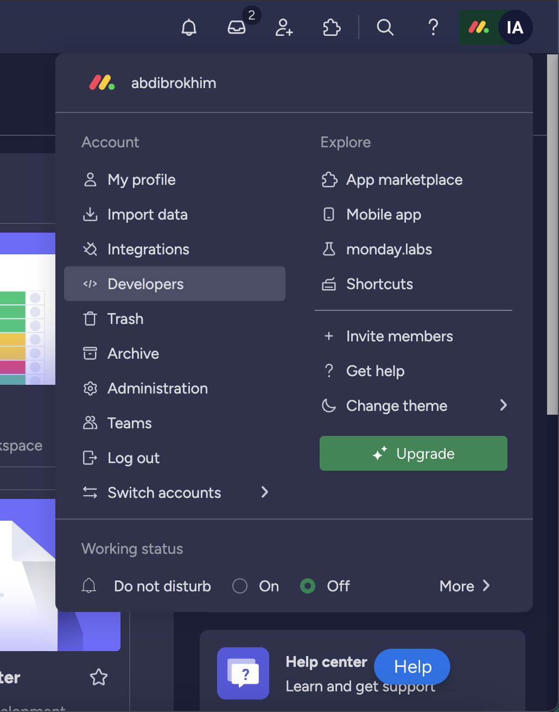
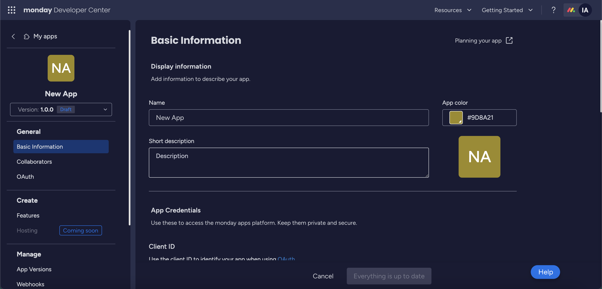
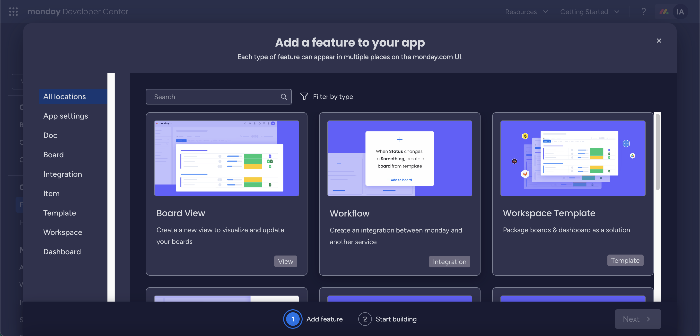
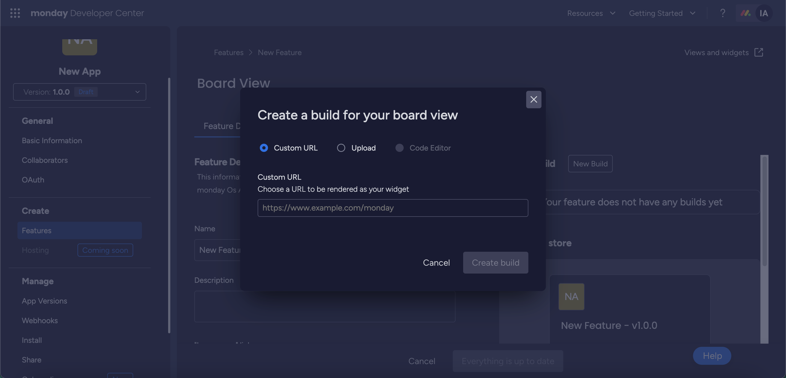
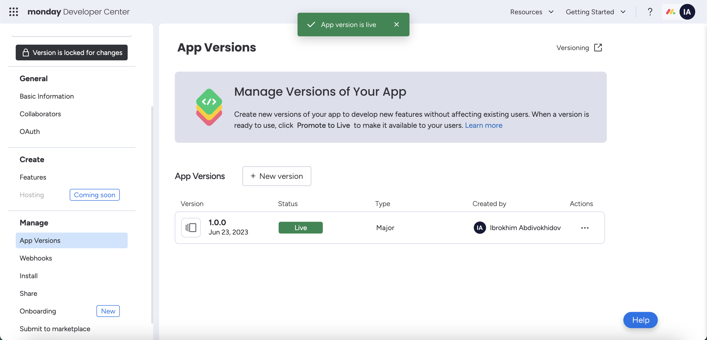
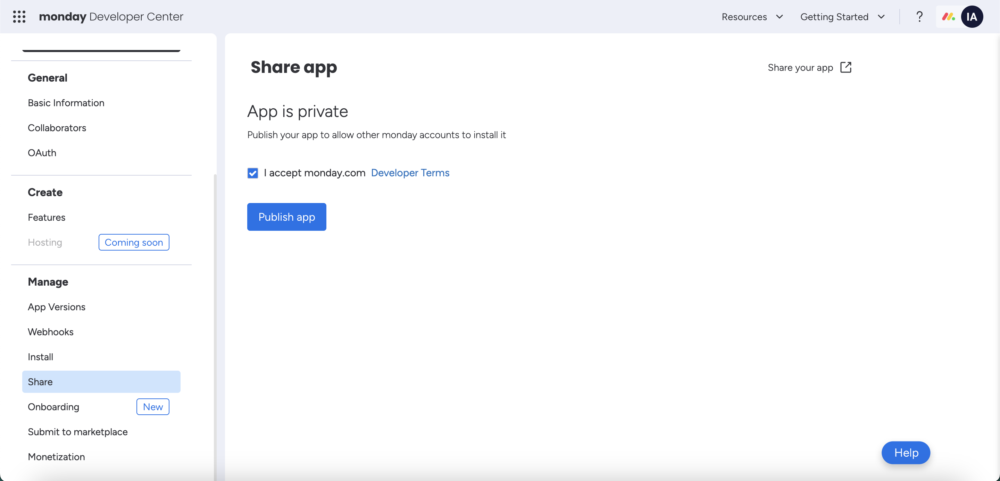
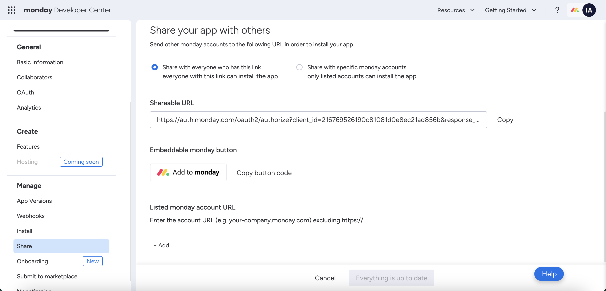

## Introduction
[Stable Diffusion](https://stability.ai/stable-diffusion), is a new generative model that can generate high-resolution images with a single forward pass.
[monday.com](), is a work operating system (Work OS) where teams create workflow apps in minutes to run their processes, projects, and everyday work. 
Teams shape workflows and projects, code-free, with an adaptive platform that automates manual work and connects teams in a digital workspace.


## Prerequisites
To use Stable Diffusion we need API Key. Go to Dream Studio, [Sign up](https://dreamstudio.ai/) for an account to be taken to your API Key. [Click me](https://dreamstudio.ai/account) once you have created an account to be taken to your API Key. Copy the API key and save it somewhere safe.
Some knowledge in [React](https://react.dev/).


## Let's get started

### Create a new project

Let's start by creating new folder for our project. Open Visual Studio Code and create new folder named `monday-tutorial`:

```bash
mkdir monday-tutorial
cd monday-tutorial
```


First, make sure you have React and axios (a popular HTTP client library) installed in your project:

```bash
npx create-react-app my-app
cd my-app
npm install axios
```


Once your React project is set up, replace the content of the `src/App.js` file with the following code:

```javascript

import React, { useState } from 'react';
import axios from 'axios';

function App() {
  const [image, setImage] = useState(null);
  const [inputText, setInputText] = useState('');

  const fetchImage = async () => {
    try {
      const response = await axios.post('http://localhost:3001/generate-image', {
        text: inputText,
      });

      if (response.data.success) {
        setImage('/v1_txt2img.png');
      }
    } catch (error) {
      console.error('Error fetching image:', error);
    }
  };

  return (
    <div style={{ textAlign: 'center' }}>
      <h1>AI Image Generator</h1>
      <input
        type="text"
        value={inputText}
        onChange={(e) => setInputText(e.target.value)}
        placeholder="Enter text"
      />
      <button onClick={fetchImage}>Generate Image</button>
      {image && }
    </div>
  );
}

export default App;

```

Now, let's create a new file named `server.js` in the root of your project and add the following code:

```javascript
const express = require('express');
const fetch = require('node-fetch');
const fs = require('fs');

const app = express();
const port = 3001;

app.use(express.json());

const engineId = 'stable-diffusion-v1-5';
const apiHost = process.env.API_HOST ?? 'https://api.stability.ai';
const apiKey = process.env.STABILITY_API_KEY;

if (!apiKey) throw new Error('Missing Stability API key.');

app.post('/generate-image', async (req, res) => {
  try {
    const response = await fetch(`${apiHost}/v1/generation/${engineId}/text-to-image`, {
      method: 'POST',
      headers: {
        'Content-Type': 'application/json',
        Accept: 'application/json',
        Authorization: `Bearer ${apiKey}`,
      },
      body: JSON.stringify({
        text_prompts: [
          {
            text: req.body.text,
          },
        ],
        cfg_scale: 7,
        clip_guidance_preset: 'FAST_BLUE',
        height: 512,
        width: 512,
        samples: 1,
        steps: 30,
      }),
    });

    if (!response.ok) {
      throw new Error(`Non-200 response: ${await response.text()}`);
    }

    const responseJSON = await response.json();
    const image = responseJSON.artifacts[0];

    fs.writeFileSync(`./out/v1_txt2img.png`, Buffer.from(image.base64, 'base64'));

    res.json({ success: true });
  } catch (error) {
    console.error('Error generating image:', error);
    res.status(500).json({ error: 'Image generation failed.' });
  }
});

app.listen(port, () => {
  console.log(`Server listening at http://localhost:${port}`);
});
    
```

Make sure you have the required dependencies installed. In the project root directory, run the following command:

```bash
npm install express node-fetch fs
```

Cool! Now, go to your github account, create `New repository` and push your project: 

```bash
git add .
git commit -m "init"
git push <link-to-repository>
```

Go to your [Vercel](https://vercel.com/dashboard) dashboard and click `Add new`, from dropdown select `Project` and `Import` just created repository.
Wait a couple of seconds while it's deploying, once it's done copy/save URL to your app, we will use it for our monday.com AI-powered app.


### Create a monday.com account

Go to [monday.com](https://monday.com) and create an account. You can use your Google account to sign up. Once you have created an account, you will be taken to your monday.com dashboard.


### Create a new monday.com app

In the upper right corner click on your `Profile picture` > `Developers`. 



You will be redirected to the `Developers` page. Click on `Build app` button. Now, you should see a page like this:



Name your app whatever you want and give a short description. For this tutorial, I named: `Stable Diffusion AI App` and description: `monday.com AI-powered app using image generative AI (like Stable Diffusion)`. Then click on `Save` button.


### Create a new feature

Click on `Features` tab and then click on `Create feature` button. Choose `Board view` > `Next` then select `Start from scratch` > `Create`. 



Perfect! If you click on `New Build` button, you will see a page like this:



You have two options, `Custom URL` where you should input link to your app or `Upload` where you can upload your app zip file. For this tutorial, we will use `Custom URL` option. 
So, paste the link which we obtained from Vercel in the previous steps, then click on `Create build` button. 
Once it's done, switch to `View Setup` tab, and click on `Go to preview` button, after a few seconds you should see your app.

Cool! Now, let's publish our app. Go to `App versions` tab on the left sidebar. Click on the `three dots` on the right side > `Publish` > `Promote`. Once you done, you should notice that your app's status switched from `Draft` to `Live`.





Congratulations! You have successfully created and published your first monday.com AI-powered App with Stable Diffusion.


### Install the app

Let's install our app. Select `Install` from sidebar, then click on `Install app` button. In addition, you can share your app with others by clicking on `Share` > `Publish share`.



Click `Copy` to copy the link to your app. Go and share it with your friends.



One, more thing before we finish. Let's add [monday.com](https://monday.com/) badge to our app. Click `Copy button code` and paste it inside your app.


## Conclusion


Thank you for following along with this tutorial.

If you have any questions, feel free to reach out to me on [LinkedIn](https://linkedin.com/in/abdibrokhim) or [Twitter](https://twitter.com/abdibrokhim). I'd love to hear from you!

made with 💜 by [abdibrokhim](https://linkedin.com/in/abdibrokhim) for [lablab.ai tutorials](https://lablab.ai/t).

