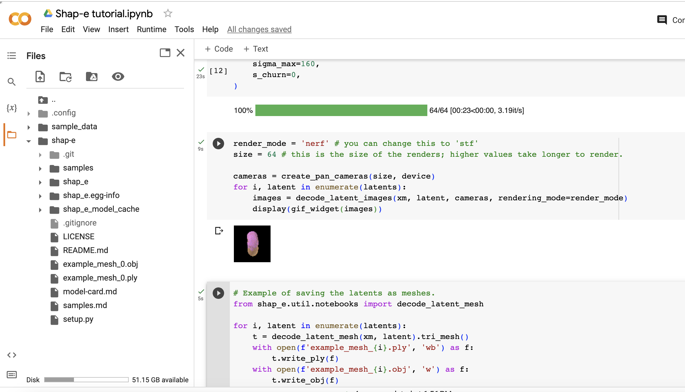
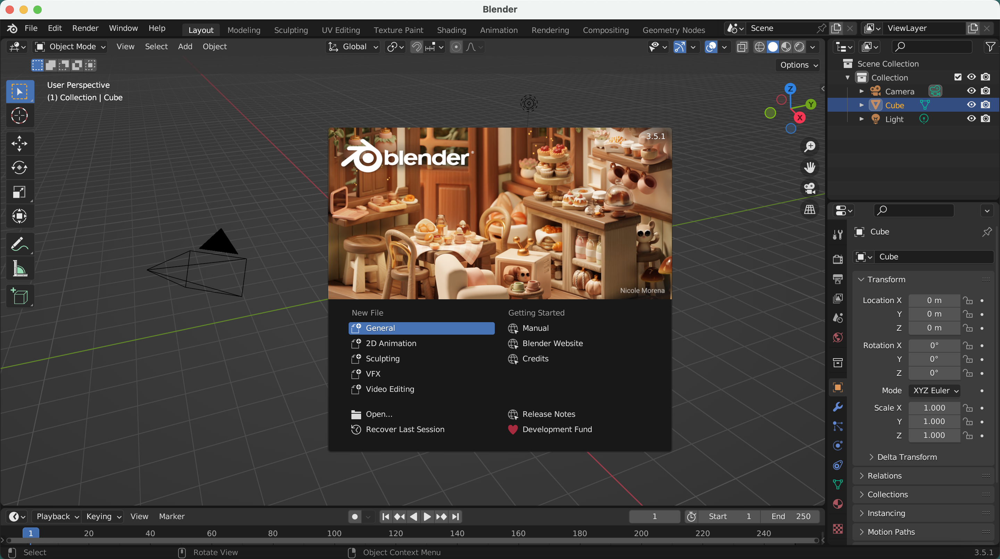
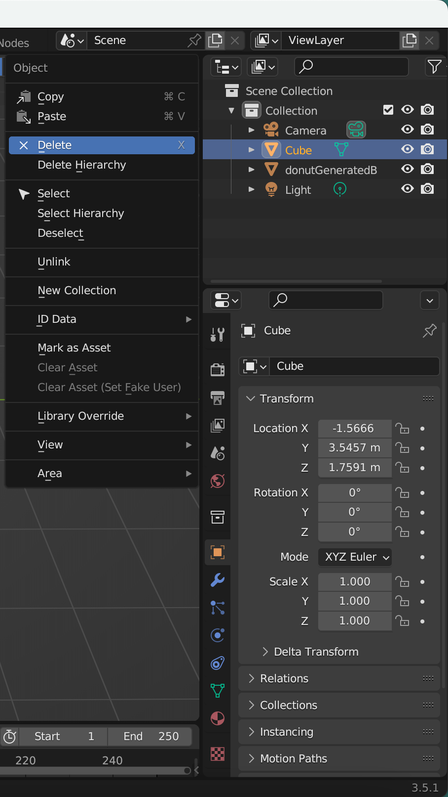
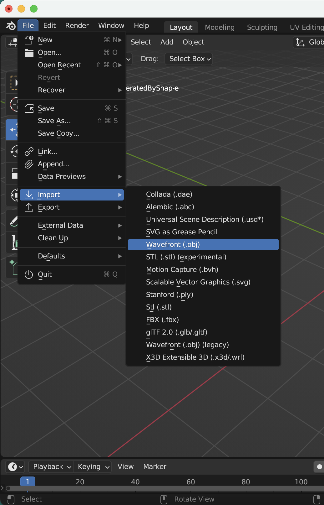
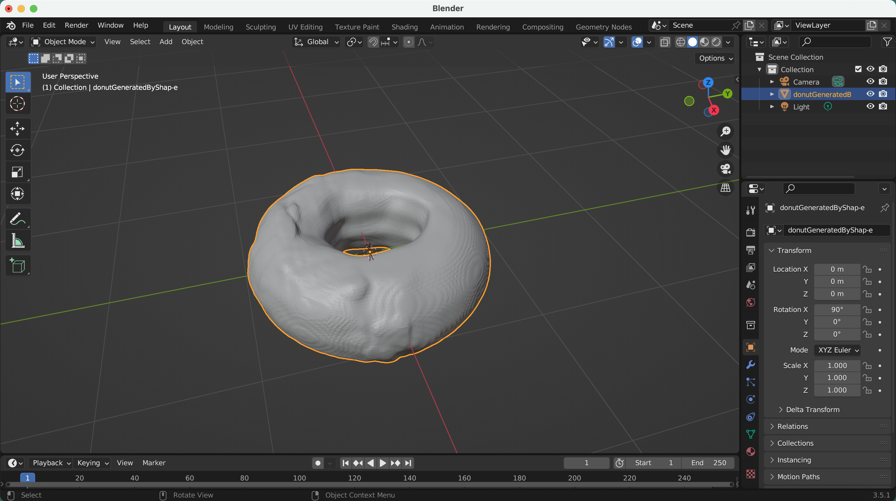
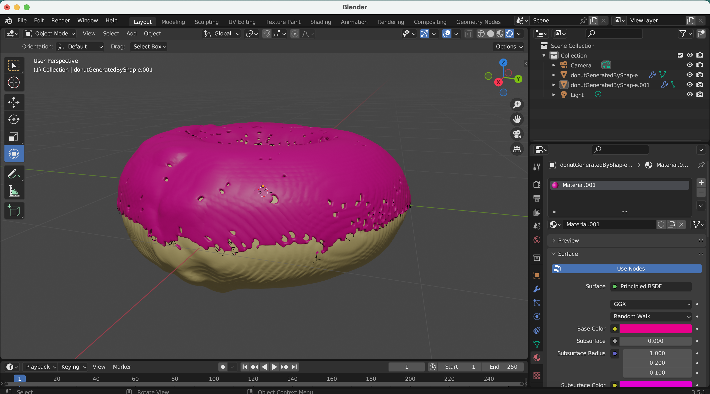

## What is Shape-E?
[Shap-E](https://lablab.ai/tech/openai/shap-e), a groundbreaking model developed by OpenAI, produces an array of 3D objects using text or images as input, transforming the realm of 3D applications with its innovative approach. This extraordinary technology is accessible for free on GitHub, allowing users to run it seamlessly on their computers without requiring an OpenAI API key or an internet connection. What makes Shap-E truly remarkable is its versatility: the generated 3D objects can be opened in software like Microsoft Paint 3D or even converted into STL files for 3D printing. With its unique capabilities, Shap-E is redefining the way we approach text-to-3D and image-to-3D generation and what creative possibilities for [AI applications](https://lablab.ai/apps) can arise from it.


## What we are going to do?
In this tutorial we will learn how to create a Notebook in Google Colab, set up and use OpenAI's Shape-E model to generate 3D models and customize them with Blender Studio.


### Prerequisites
Go to [Blender.org](https://www.blender.org/download/) and download Blender Studio compatible with your operating system.

## Let's start!
### Step 1 - Setting up the project

Let's start by creating new Notebook in Google Colab.

Go to [Google Colab](https://colab.research.google.com/) and create new Notebook.


### Step 2 - Clone the repository

Now, we need to clone Shap-E repository to our Google Colab Notebook.

```bash
!git clone https://github.com/openai/shap-e
```

Enter the directory and install the requirements.

```bash
%cd shap-e
!pip install -e .
```

### Step 3 - Implementation and Cooking the 3D models.

Add new `code cell`.

Here we will import all the necessary libraries.
    
```python
import torch

from shap_e.diffusion.sample import sample_latents
from shap_e.diffusion.gaussian_diffusion import diffusion_from_config
from shap_e.models.download import load_model, load_config
from shap_e.util.notebooks import create_pan_cameras, decode_latent_images, gif_widget
```

Click `Run` button or `CMD/CTRL + Enter` to run the single `code cell`.

Cool!


Add new `code cell`.

Here we will set the device to `cuda` if available, otherwise to `cpu`.

```python
device = torch.device('cuda' if torch.cuda.is_available() else 'cpu')
```

Click `Run` or `CMD/CTRL + Enter`.


Add new `code cell`.

Here we will load the models and weights. 

```python
xm = load_model('transmitter', device=device) 
model = load_model('text300M', device=device) 
diffusion = diffusion_from_config(load_config('diffusion')) 
```

Click `Run` or `CMD/CTRL + Enter`.

Please be patient, it will take some time to load the models and weights. For me it took around 5 minutes. Yeah, sure it's depends on your internet connection speed.

You are doing great!


Add new `code cell`.

Here we will generate the 3D models.

```python
batch_size = 1 # this is the size of the models, higher values take longer to generate.
guidance_scale = 15.0 # this is the scale of the guidance, higher values make the model look more like the prompt.
prompt = "a donut" # this is the prompt, you can change this to anything you want.

latents = sample_latents(
    batch_size=batch_size,
    model=model,
    diffusion=diffusion,
    guidance_scale=guidance_scale,
    model_kwargs=dict(texts=[prompt] * batch_size),
    progress=True,
    clip_denoised=True,
    use_fp16=True,
    use_karras=True,
    karras_steps=64,
    sigma_min=1e-3,
    sigma_max=160,
    s_churn=0,
)
```

Click `Run` or `CMD/CTRL + Enter`.

It will take some time to generate the 3D models, based on your `batch_size` higher `batch_size` will take longer time to generate the 3D models. For me it took around 22 seconds to generate 3D models with `batch_size=1`.


Add new `code cell`.

Here we will render the 3D models, using `render_mode = 'nerf'` [Neural Radiance Fields (NeRF)](https://www.matthewtancik.com/nerf) to render the 3D models. You can change this to `render_mode = 'stf'` to render the 3D models with [Style Transfer Function (STF)](https://www.researchgate.net/publication/227615609_Style_Transfer_Functions_for_Illustrative_Volume_Rendering) rendering mode.

```python
render_mode = 'nerf' # you can change this to 'stf'
size = 64 # this is the size of the renders, higher values take longer to render.

cameras = create_pan_cameras(size, device)
for i, latent in enumerate(latents):
    images = decode_latent_images(xm, latent, cameras, rendering_mode=render_mode)
    display(gif_widget(images))
```

Click `Run` or `CMD/CTRL + Enter`.

Did you see the models are rotating? Cool, right?


Let's continue.


Add new `code cell`.

Here we will save the 3D models as `.ply` and `.obj` files. 

Note: `.obj`, this we will use to customize in Blender Studio later.


```python
# Example of saving the latents as meshes.
from shap_e.util.notebooks import decode_latent_mesh

for i, latent in enumerate(latents):
    t = decode_latent_mesh(xm, latent).tri_mesh()
    with open(f'example_mesh_{i}.ply', 'wb') as f: # this is three-dimensional geometric data of model.
        t.write_ply(f)
    with open(f'example_mesh_{i}.obj', 'w') as f: # we will use this file to customize in Blender Studio later.
        t.write_obj(f)
```

Click `Run` or `CMD/CTRL + Enter`.

Toggle the tab to `Files` and tap the refresh. You will see the `example_mesh_0.ply` and `example_mesh_0.obj` files. 



Download the `.obj` file to your local machine.


### Step 4 - Customizing the 3D models in Blender Studio.

Open the Blender Studio and create new project.




Delete the default cube.




Click `File` > `Import` > `Wavefront (.obj)`. Select the `.obj` file that you've downloaded from Google Colab. 




You should see the 3D model at the center.



WooW!, it looks cool itself, isn't it? Shap-E did a great job, by the way. 

You can customize the 3D model as you wish.

For demonstration purposes, I simple colored topping with pink and the donut with brown color.




## Shap-E is trurly amazin!


In this tutorial, we've learned how to to set up and use Shape-E model using Google Colab. Moreover, we've look into Blender Studio and tried to customize generated 3D model. 

Now it's your turn to test out the skills you've learnt and create your own 3D art. And as you will play around with it more, maybe you will find some limitations and want to fix it in your own [Shap-e app](https://lablab.ai/apps/tech/openai/shap-e)?

Why not do this during an [Artificial Intelligence Hackathons](https://lablab.ai/event)? And by the way win cool prizes! Be part of the AI enthusiasts community and learn more about AI and its potential!

Thanks for reading this tutorial.

made with 💜 by [abdibrokhim](https://linkedin.com/in/abdibrokhim) for [lablab.ai tutorials](https://lablab.ai/t).

